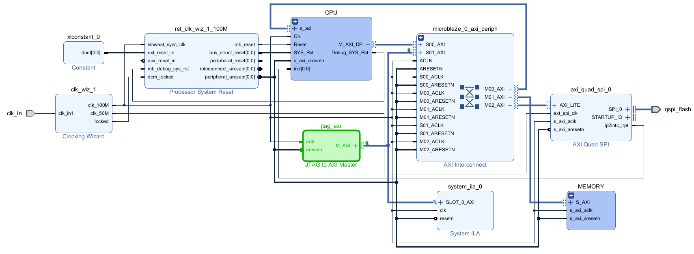
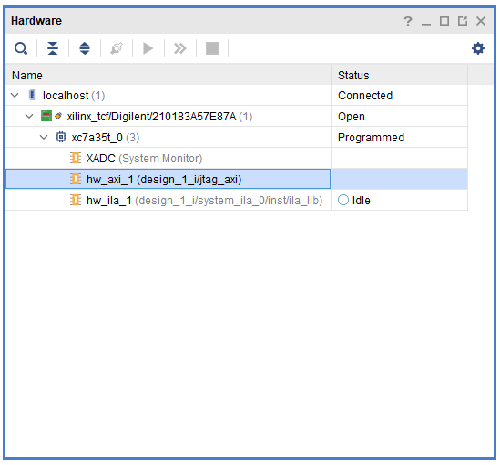
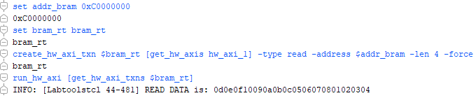
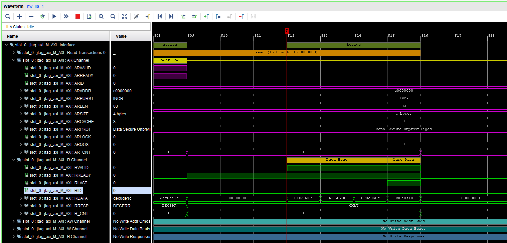

# JTAG to AXI Master IP

Xilinx has an IP called `JTAG to AXI Master`. As far as I've seen in the literature, it's not a widely used IP. It is essentially designed for debugging purposes. It's particularly used to access multiple address spaces from a single point via `AXI-Lite` or `AXI Memory Mapped` interface. Below is an example figure showing how JTAG to AXI Master IP will fit into a project:


Fundamentally, with this IP, we can access desired AXI-Lite or AXI Memory Mapped slave interface using `TCL console` after FPGA is programmed without need for any program other than Vivado, as shown in the figure above.

## Motivation

For example; we use **AXI IIC**, **AXI Quad SPI**, and **AXI Bram Controller** IPs in a project. In this case, an address offset is determined for each one (by Vivado or a user). Considering these addresses, data is written to relevant parts as required by the project or IPs. However, to make small trials during development phase, we need to access and write/read relevant IP via AXI-Lite or AXI Memory Mapped. Thanks to JTAG to AXI Master IP, we can access the relevant **AXI interfaces** of IPs included in the project. To do this, there is no need for solutions that require other programs like **Vitis** or its former name **Xilinx SDK** or operating systems.

## Other Alternatives

It is also necessary to mention other alternative solutions. Below are brief explanations regarding other solutions:

- Xilinx Vitis (formerly known as Xilinx SDK) program has **xsct** support. For this, `MicroBlaze Debug Module (MDM)` IP is needed. After various processes, necessary data can be written to relevant addresses with `mwr` or `mrd` commands.
- By adding Microblaze IP to the design and opening `Memory` window via Xilinx Vitis (or Xilinx SDK), necessary data can be written to relevant addresses with the help of a GUI.
- `devmem` can be used on boards where we can install an operating system.

## Advantages of JTAG to AXI Master IP

The biggest advantage of this IP is that we do not need any program or window other than Vivado. That is, we can use this IP after programming FPGA via Vivado by using `tcl console`.

On the other hand, in other solutions, a lot of extra processes may be required, or multiple programs may be needed. Therefore, using this IP in the early stages of development becomes a very logical tool.

## How to Use

Firstly, we need a design similar to the one below, which must include IPs that we can communicate with via AXI.



In the subblock indicated by `MICROBLAZE` above, there are Microblaze and other necessary IPs. In the part indicated by `MEMORY`, there are Block Memory Generator and AXI BRAM controller IPs.

The green indicated IP is JTAG to AXI Master IP that we will be working on. As can be seen, there are two IPs we can access via AXI. One is AXI Quad SPI, and the other one is MEMORY subblock.

Also, I connected `ILA` to better observe AXI transactions. This way, we will verify **burst** data flow when AXI Memory Mapped interface is set. In AXI-Lite interface setting, we will only be able to observe data flow.

Below are the IP settings. As can be seen, it is very easy to configure. All we need to do is select one of AXI-Lite or AXI Memory Mapped buses according to our needs. If burst data transfer is desired, `AXI4` should be selected. If there is no such requirement, selecting `AXI4LITE` will be more efficient in terms of resources the IP will consume.


Although we use this IP in early stages of development, we can also leave it in final stage of projects. For example, let's consider a project where we use **Microblaze**. Normally, in final stage of the project, we can configure AXI Quad SPI IP or perform data read/write operations via a code we will write through Vitis. Still, this IP can be present in the project along with the code running on Microblaze. Thus, it can be a quick alternative that we can use in case of problems that may arise after the development phase.

Here, the difference between **ILA** or **VIO** and JTAG to AXI Master is that we can perform real-time debugging with much fewer resources and easily drive a bus like AXI, which has many ports.

Below I have shared the address editor part of demo project. While performing real-time trials, we will use these addresses as offsets.


After the bitstream belonging to the design is created and FPGA is programmed via Vivado Hardware Manager part, `Hardware` part on the left will look like the following. As seen in the second row, JTAG to AXI Master IP is recognized as hardware. This situation is also present in IPs like ILA and VIO.



From this point on, we can access IPs connected to `AXI Interconnect IP` (or AXI Smartconnect) by following the steps below.

## AXI-Lite Interface Setting

`AXI Protocol` setting of JTAG to AXI Master IP that we added to the block design should be set to `AXI4LITE`. With the design synthesized in this way, after FPGA is programmed, the following commands can be entered to perform a write transaction to the relevant address via AXI-Lite interface.

```tcl
set addr_bram 0xC0000000
set bram_wt bram_wt
create_hw_axi_txn $bram_wt [get_hw_axis hw_axi_1] -type write -address $addr_bram -data {0x00000008} -force
run_hw_axi [get_hw_axi_txns $bram_wt]
```

Below is an explanation of what each command means:

- `set addr_bram 0xC0000000`: Address definition is assigned to a variable. In this example, the offset address of BRAM is assigned.
- `set bram_wt bram_wt`: The transaction object is defined and assigned to a variable.
- `create_hw_axi_txn...`: A write transaction is created. No data transfer etc. is done yet. Definitions related to the transaction to be made are made and introduced to the transaction object.
- `run_hw_axi...`: The write transaction is performed.

After running the commands, the TCL lines will look like this:


Also, the transaction we created appears as follows in ILA:


Below are the commands that should be used for a read transaction:

```tcl
set addr_bram 0xC0000000
set bram_rt bram_rt
create_hw_axi_txn $bram_rt [get_hw_axis hw_axi_1] -type read -address $addr_bram -force
run_hw_axi [get_hw_axi_txns $bram_rt]
```

After running the commands, the TCL lines will look like this:


Also, the transaction we created appears as follows in ILA:


As seen in the images above, value `00000008` is written to address `0xC0000000` and then read from the same address. It is proven that the written and read values are the same.

## AXI Memory Mapped Setting

`AXI Protocol` setting of JTAG to AXI Master IP that we added to the block design should be set to `AXI4`. With the design synthesized in this way, after FPGA is programmed, the following commands can be entered to perform a write transaction to the relevant address via AXI Memory Mapped interface.

```tcl
set addr_bram 0xC0000000
set bram_wt bram_wt
create_hw_axi_txn $bram_wt [get_hw_axis hw_axi_1] -type write -address $addr_bram -data {0x01020304 0x05060708 090a0b0c 0d0e0f10} -len 4 -force
run_hw_axi [get_hw_axi_txns $bram_wt]
```

In the above commands, unlike the AXI-Lite setting, there are `-len 4` and multiple data values next to the `-data` part. The `-len` parameter specifies the number of data to be written/read. The `-data` parameter specifies the data to be written to the relevant addresses in address order. In the example above, the value `0x01020304` is written to the first address (`0xC0000000` address).

After running the commands, the TCL lines will look like this:


Also, the transaction we created appears as follows in ILA. Unlike AXI-Lite interface, burst data flow occurs:


Below are the commands that should be used for a read transaction:

```tcl
set addr_bram 0xC0000000
set bram_rt bram_rt
create_hw_axi_txn $bram_rt [get_hw_axis hw_axi_1] -type read -address $addr_bram -len 4 -force
run_hw_axi [get_hw_axi_txns $bram_rt]
```

After running the commands, the TCL lines will look like this:



Also, the transaction we created appears as follows in ILA.



We were able to read the data we wrote in the same way.

## Final Thoughts

I was very skeptical when I first looked at the IP. It seemed illogical while solutions like `xsct`, `Vitis` were available, but I realized as I used it that it could be useful in the early stages of development. It is very easy to use and learn. We can configure AXI interface IPs or write data to relevant parts using only Vivado.

By writing short TCL codes, we can do many things without other solutions or programs. As a result, I found it worth using.

## References

- [JTAG to AXI Master Usage Video](https://www.xilinx.com/video/software/jtag-to-axi-master-core.html)
- [Xilinx JTAG to AXI Master Documentation](https://docs.amd.com/v/u/en-US/pg174-jtag-axi)
- [Example Usage of JTAG to AXI Master](https://xilinx-wiki.atlassian.net/wiki/spaces/A/pages/64488613/Using+the+JTAG+to+AXI+to+test+Peripherals+in+Zynq+Ultrascale)
