# AXI4-Stream Protokolü

Mühendislik mesleğinin hemen hemen her alanında veriyi bir yerden başka bir yere
taşıma işlemi gerçekleştirilir. Bu taşıma işlemini `Bus` ismini verdiğimiz
yapılarla yapmak mümkün. Bu yazıda, Xilinx FPGA'lerin vazgeçilmez bus
yapılarından biri olan `AXI4-Stream` protokolüne değinilecektir.

## AXI4-Stream Protokolü Nedir?

Xilinx FPGA'lerin çip içerisinde veri akışını sağladığı protokollerden biri AXI4
protokolüdür. `Arm` şirketinin bünyesi altında geliştirilen bu bus yapısını
özellikle içerisinde PS (Processing System) veya Microblaze bulunduran FPGA
projelerinde görmek çok muhtemel. Temelde, Arm'ın oluşturduğu üç AXI4 çeşidi
bulunmaktadır:

- **`AXI4-Memory Mapped (AXI4-MM):`** Diğer çeşitlerle karşılaştıracak olursak
  en kompleks bus AXI4-MM'dir. İçerisinde write-data, read-data, write-address,
  read-address ve write-response isimlerinde beş adet kanal bulunmaktadır. Bir
  sonraki maddede bahsedilecek AXI4-Lite bus yapısından en önemli farkı
  içerisinde `Burst` veri akışı olmasıdır.
- **`AXI4-Lite (AXI4-L):`** Temelde AXI4-MM ile aynıdır fakat içerisinde burst
  yapısının bulunmaması yönüyle AXI4-MM bus yapısının basitleştirilmiş hali gibi
  tanımlanabilir. Xilinx IP'lerinin bir çoğunda, AXI4-MM yerine bu bus yapısı
  tercih edilmektedir.
- **`AXI4-Stream (AXI4-S):`** Yazının odak noktası olan bu bus içerisinde
  kanallar bulunmaz. Diğer çeşitlerde çift yönlü veri iletimi bulunmasına rağmen
  bu bus içerisinde tek tönlü bir iletim söz konusudur.

Her bus yapısında olduğu gibi bu bus yapısında da belli bir protokol akışı
bulunmaktadır. AXI4 bus çeşitlerinin tümünde `master-slave` anlayışı vardır. Bu
anlayışta haberleşmeyi başlatan bir yönetici ve haberleşme protokolüne göre
hareket eden bir köle (Türkçe tabiri ile) bulunmaktadır.

Yazının temel odak noktası AXI4-Stream protokolü olduğundan ilerideki kısımlar,
bu bus yapısına göre hazırlanmıştır. AXI4-Stream bus yapısına ait örnek bir
figür aşağıdadır:

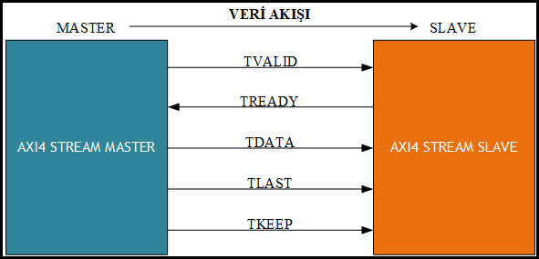

## AXI4-Stream Port Tanımları

Protokolü gerçekleştirebilmek için master ve slave taraflarının sürmesi gereken
belli sinyal/sinyaller bulunmaktadır. Aşağıda, her bir AXI4-Stream protokol
sinyaline ait çeşitli bilgileri içeren tablo bulunmaktadır:

| Sinyal İsmi | Sinyali Süren Taraf | Zorunluluk Derecesi |Bit Sayısı | Tanımı |
| :---------- | :------------------ | :------------------ | :-------- | :----- |
| TVALID      | Master              | Kesinlikle Önerilir             | 1         | Master kısmının **geçerli** bir veriyi sürmeye çalıştığını slave tarafına haber verir. |
| TREADY      | Slave               | Kesinlikle Önerilir             | 1         | Slave kısmının veri almaya hazır olduğu bilgisini master kısmına haber verir. |
| TDATA       | Master              | Kesinlikle Önerilir             | 8n        | Master kısmının göndermek istediği veri, bu sinyal aracılığı ile taşınır. |
| TLAST       | Master              | Kesinlikle Önerilir             | 1         | Master tarafından gönderilen **TDATA** verilerinin sonuncusunda kullanılan bu sinyal, o verinin son **TDATA** verisi olduğunu slave tarafına haber verir. Gönderilecek **TDATA** veri sayısı bir paket için bir veya birden fazla olabilir. |
| TKEEP       | Master              | Kesinlikle Önerilir             | n         | Master kısmından taşınan **TDATA** sinyalindeki **geçerli** byte'ları slave tarafına iletir. Bu sayede slave tarafı, gelen verideki hangi byte'ları kullanıp hangi byte'ları çöpe atacağını/kullanmayacağını bilir. Bu yüzden boyutu daima verinin bit sayısının 8'de biridir. |
| TSTRB       | Master              | Zorunlu Değil       | n         | **TDATA** sinyalindeki byte'ların veri byte'ı veya konum byte'ı olup olmadığını belirtir. Konum byte'ı, bir veri paketi içerisinde **TSTRB** içerisindeki bir bitin işaret ettiği **TDATA** byte'ının o paket içerisindeki göreceli yeri demektir. **TKEEP** ile birlikte kullanılabilen bir sinyaldir. Bu iki sinyalin arasındaki ilişkiye ait ayrıntılı bilgiden daha sonra bahsedilecektir. |
| TID         | Master              | Zorunlu Değil       | a         | Verinin geldiği master kısmına ait özgün bir adres olarak tanımlanabilir. |
| TDEST       | Master              | Zorunlu Değil       | b         | Verinin gideceği slave kısmına ait özgün bir adres olarak tanımlanabilir. |
| TUSER       | Master              | Zorunlu Değil       | c         | İsminden de anlaşılacağı üzere kullanıcı, bu sinyal içerisine çeşitli yan bilgiler ekleyebilir. |

Yukarıdaki tabloda;

- 8n: veri bit sayısıdır.
- a: `TID` bit sayısıdır. Resmi dokümanlarda bu sayının önerilen maksimum değeri
  8 bit olarak belirlenmiştir.
- b: `TDEST` bit sayısıdır. Resmi dokümanlarda bu sayının önerilen maksimum
  değeri 4 bit olarak belirlenmiştir.
- c: `TUSER` bit sayısıdır. Resmi dokümanlarda bu sayının önerilen maksimum
  değeri 8 bit olarak belirlenmiştir.

```{note}
`TSTRB`, `TID`, `TDEST`, `TUSER` sinyalleri kullanıma göre içerik bakımından değişiklik gösterebilir. Kullanımları zorunlu olmadığından ve kullanım alanı itibariyle çok fazla gerek duyulmadığından Xilinx IP'lerinin çoğunda bu sinyaller kullanılmaz veya opsiyoneldir.
```

```{note}
Kesinlikle önerilen sinyallerden biri veya birkaçı, bazı Xilinx IP'lerinde kullanılmaz veya opsiyonel olarak bırakılmıştır. Bu sinyalleri ekleme/çıkarma seçeneği kullanıcıya bırakılmıştır.
```

```{note}
Standard dahilinde zorunlu sinyal diye bir kavram bulunmamaktadır. Yani isteğe bağlı olarak, herhangi bir projede TVALID, TDATA, TREADY gibi sinyaller kullanılmayabilir. Bu yüzden yukarıdaki tabloda; kullanılması önemli sinyaller, zorunlu olarak değil de kesinlikle önerilen sinyaller olarak tanımlanmıştır.
```

```{note}
TDATA bit genişliği 8n ve TKEEP bit genişliği n olarak verilmiştir fakat TDATA 8'in katı değil ise TKEEP, TDATA bit genişliğinin 8'e bölünerek tavana yuvarlama yapılması ile bulunur. Örneğin; TDATA 22 bit ise TKEEP 22/8=2.75 olması gerekir fakat bit genişliğinin tamsayı olması gerektiğinden TKEEP tavana yuvarlama ile 3 olarak belirlenir.
```

Bir sonraki kısımlarda çeşitli protokollerden ve AXI4-Stream sinyallerinin nasıl
sürülmesi gerektiğinden bahsedilecektir.

## TVALID-TREADY Kullanımı ve Handshake İşlemi

Bir önceki kısımda bulunan tablodan anlaşılacağı üzere master tarafı TVALID
sinyalini slave tarafına, slave tarafı ise TREADY sinyalini master tarafına
sürer. Bu iki sinyali sürerken uyulması gereken belli bir protokol vardır. Buna
`Handshake` ismi verilmiştir. Kelimeden de anlaşılacağı üzere bu işlem sayesinde
master ve slave tarafı el sıkışır ve bu el sıkışma sonucunda master tarafından
slave tarafına veri akışı gerçekleşmiş olur.

Handshake protokolündeki temel kural şudur ki TVALID ve TREADY sinyalleri aynı
clock cycle içerisinde `high` (**1** konumunda) olduğunda slave tarafı bunu
algılar ve master tarafından gelen TDATA bilgisini kullanabilir.

Bu noktada TVALID ve TREADY sinyallerinin sürülmesi ilgili temel bazı kurallar
vardır. Bu kurallar aşağıda listelenmiştir:

- **KURAL 1: Master tarafı veriyi süreceği zaman TREADY sinyalinin 1 konumunda
  olmasını asla ama asla beklememelidir. Veri göndermeye hazır olduğunda veriyi
  TDATA sinyaline sürmeli ve yine aynı clock cycle içerisinde TVALID sinyalini 1
  sürmelidir. Kısacası; TVALID, TREADY sinyalinin 1 olmasını kesinlikle
  beklememelidir. Bu durum `Kural 3` ile ilişkilidir.**

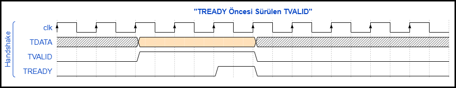

Yukarıdaki figürde TVALID sinyali ve TDATA verisi, TREADY sinyalini
beklemeksizin sürülmüş ve TREADY sinyalinin 1 olması durumunda handshake
gerçekleşmiştir. Hazırda başka bir veri olmadığından TVALID sinyali 0 konumuna
getirilmiştir. TDATA sinyalindeki siyah çizgili kısımlarda veri henüz hazır
değildir.

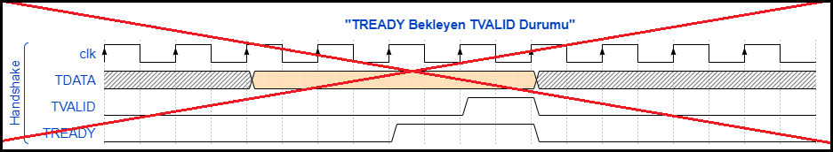

Yukarıdaki figürde TDATA içerisinde gönderilmeye hazır bir veri olmasına rağmen
TVALID 1 sürülmemiştir ve TREADY sinyalini beklemiştir. Bu durum hatalıdır,
protokole aykırıdır.

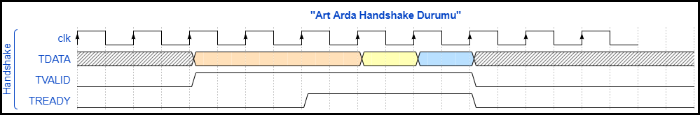

Yukarıda, art arda handshake durumuna ait bir figür bulunmaktadır. Figürde bir
handshake sonrası verinin hemen hazır olmasından dolayı iki kez daha handshake
gerçekleşmiştir. Bu şekilde verimin artırılması amaçlanmış olabilir.

- **KURAL 2: Master tarafı TVALID ve TDATA sinyallerini sürdükten sonra
  handshake gerçekleşmeden bu sinyallerde değişiklik yapmamalıdır.**

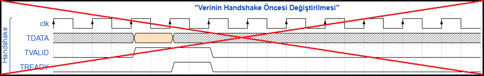

Yukarıdaki figürde TVALID sinyaline 1 ve TDATA sinyaline hazırdaki veri
sürülmesine rağmen handshake gerçekleşmeden TDATA değeri değiştirilmiştir. Bu
durum hatalıdır ve protokole aykırıdır çünkü handshake gerçekleşene kadar TDATA
sinyali, TVALID ile birlikte sürüldükten sonra değişmemesi gerekir.

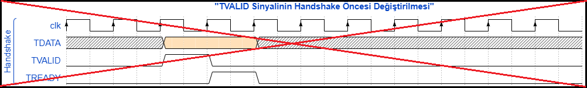

Yukarıdaki figürde TVALID sinyaline 1 ve TDATA sinyaline hazırdaki veri
sürülmesine rağmen handshake gerçekleşmeden TVALID değeri tekrar 0 değerine
sürülmüştür. Bu durum hatalıdır ve protokole aykırıdır çünkü handshake
gerçekleşene kadar TVALID sinyalinin 1 olarak sürüldükten sonra handshake
oluşana kadar değişmemesi gerekir.

- **KURAL 3: Slave tarafı, TREADY sinyalini sürerken rahat davranabilir. TVALID
  sinyalinin 1 olmasını bekleyebilir veya TVALID sinyalinin 1 olmasını
  beklemeden 1 sürebilir.**

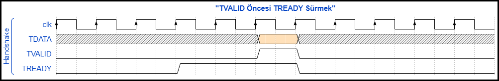

Yukarıdaki figürde TREADY sinyali TVALID sürülmeden önce 1 sürülmüştür.

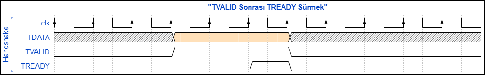

Yukarıdaki figürde TREADY sinyali TVALID sürüldükten sonra 1 sürülmüştür.

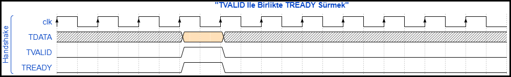

Yukarıdaki figürde TREADY sinyali TVALID ile birlikte sürülmüştür.

- **KURAL 4: Slave tarafından 1 sürülen TREADY sinyaline, handshake
  gerçekleşmeden 0 sürülebilir.**


Yukarıdaki figürde handshake gerçekleşmeden TREADY sinyaline 1 değeri sürülüp
tekrar 0 değeri sürülmüştür. Bu durumda bir sakınca yoktur.

- **KURAL 5: Slave tarafından sürülen TREADY sinyali, handshake gerçekleştikten
  sonra 1 konumunda kalabilir.**

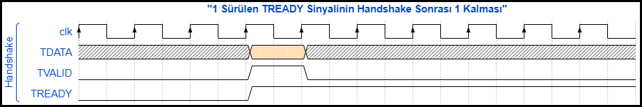

Yukarıdaki figürde handshake gerçekleştikten sonra TREADY sinyali 1 olarak
bırakılmıştır. Bu durumda bir sakınca yoktur.

- **KURAL 6: Handshake olması halinde yeni bir handshake veya veri sürme olayı
  yaşanmayacaksa TDATA en sondaki konumunda kalabilir, resetlemek/sıfırlamak
  zorunlu değildir.**

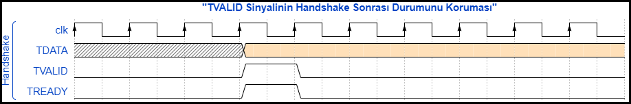

Yukarıdaki figürde handshake sonrası TDATA durumunu korumuştur, yani sıfırlama
işlemi yapılmamıştır.

Daha önce de bahsedildiği üzere handshake, AXI4-Stream protokolünün dikkat
edilmesi gerekilen en önemli ögesidir. Yukarıda belirtilen adımlara dikkat
edildiği sürece protokol bakımından bir hata alınması söz konusu değildir.

## TLAST Kullanımı

TLAST sinyali paket yapısı içerisinde gönderilen verilerin sonuncusunu belirtmek
için kullanılır. Aşağıda, TLAST kullanımına ait çeşitli kurallar bulunmaktadır:

- **KURAL 1: Boyutu TDATA bit boyutundan daha büyük olan paketlerde, gönderilen
  son verinin handshake durumunda TLAST 1 olmalıdır.**

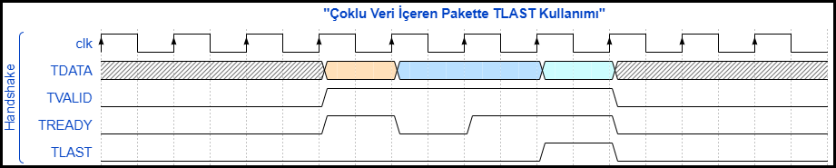

Yukarıdaki figürde içerisinde 3 TDATA boyutunda veri bulunan bir paketin master
tarafından slave tarafına gönderimi gösterilmiştir. Paketin gönderilecek son
TDATA clock cycle'ı içerisinde TLAST 1 sürülmüştür.

- **KURAL 2: Paket içerisindeki veri sayısı bir olsa dahi TLAST kullanılabilir.
  Bu durumda her handshake oluşumunda TLAST 1 sürülmelidir.**

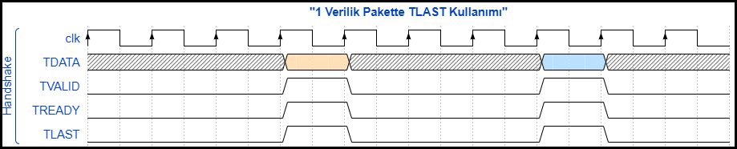

Yukarıdaki figürde veri paketi bir handshake yetecek büyüklüktedir. Bundan
dolayı her paket gönderiminde TLAST 1 olarak sürülmüştür.

- **KURAL 3: TLAST sinyalinin son gönderilecek TDATA ve TVALID ile aynı clock
  cycle içerisinde sürülmesi önerilir. Bu şekilde sinyali takip etmesi
  kolaylaşacaktır.**

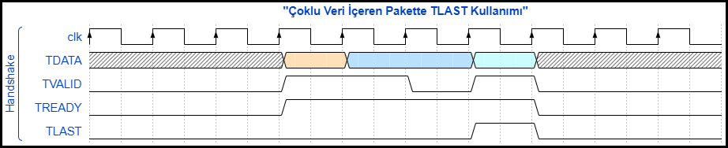

Yukarıdaki figürde 2 handshake sonrası bir clock cycle TVALID 1 sürülememiştir.
Son veriyi ve TVALID sinyalini sürerken TLAST 1 olarak sürülmüştür.

- **KURAL 4: Son verinin handshake durumu sonrası TLAST, bir sonraki paketin ilk
  verisi gönderilene kadar 1 veya 0 olarak kalabilir/sürülebilir. Eğer bir
  sonraki paketin boyutu TDATA boyutunu aşıyorsa ve TLAST bir sonraki paketin
  ilk handshake durumuna kadar 1 sürülmüşse handshake gerçekleşirken TLAST
  sinyalinin 0 sürüldüğünden emin olunmalıdır.**

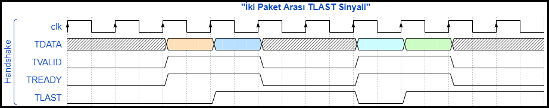

Yukarıdaki figürde paket gönderimi bittikten sonra TLAST, 1 durumunu bir sonraki
paketin ilk verisine kadar korumuştur. İkinci Paketin ilk verisinde tekrar 0
olarak sürülmüştür.

## TKEEP Kullanımı

TKEEP sinyali protokol içerisinde TDATA sinyalinin hangi byte'ının geçerli olup
olmadığı bilgisini taşır. Bu yüzden daima, TDATA sinyalinin bit sayısı boyutunun
8'de biri boyutundadır. Örneğin; TDATA sinyalinin 16 bit olduğu bir senaryoda
TKEEP 2 bit olarak sürülmelidir. Bu durumda, handshake durumu oluşması halinde,
eğer TKEEP **"0b01"** olarak slave tarafına gelmişse TDATA sinyalinin en önemli
8 biti (Most significant 8 bits) geçersizdir, kullanılmamalıdır. Aşağıda TKEEP
sinyaline ait çeşitli kurallara yer verilmiştir:

- **KURAL 1: TKEEP sinyalinin herhangi bir biti, o bite karşılık gelen TDATA
  sinyalinin byte'ını geçerli veya geçersiz yapar.**

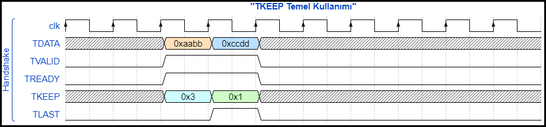

Yukarıdaki figürde, ilk gönderilen verinin TKEEP sinyali **0x3** olduğu için
slave tarafı bu veriyi tümüyle almalıdır. Son gönderilen verinin TKEEP sinyali
ise **0x1** olduğundan TDATA verisinin en önemli 8 biti geçersiz kabul edilip
kullanılmamalıdır. Yukarıdaki figürde TDATA sinyalinin gönderilen son verisinde
sadece **0xdd** verisi geçerlidir, **0xcc** verisi kullanılmaz.

- **KURAL 2: TKEEP sinyali paketin herhangi bir verisi gönderilirken 0
  içerebilir. TLAST 1 olmadığı durumlarda TKEEP 0 içeremez diye bir kural
  yoktur. Ayrıca, TKEEP sinyalinin herhangi bir biti 0 olabilir.**

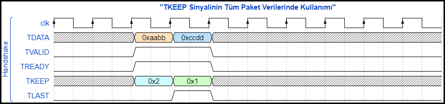

Yukarıdaki figürde, gönderilen paketin her iki verisinde çeşitli TDATA kısımları
geçersizdir. İlk verinin **0xbb** kısmı, ikinci verinin **0xcc** kısımları
geçersizdir. Ayrıca, yukarıdaki figürde de görüldüğü üzere TKEEP sinyalinin
herhangi bir biti 0 olabilir, bu durum hakkında bir kısıtlama bulunmamaktadır.

- **KURAL 3: TKEEP sinyalinin içeriği tüm paket verilerinde 0 içerebilir fakat
  Arm kendi kaynaklarında bu durumu tercih etmez. Bu gibi durumlarda paket
  verisi mümkün olduğunca birleştirilmeye (merging) çalışılır. Bu şekilde verim
  artırılması amaçlanır. Sonuç olarak, bahsedilen senaryoda genelde TKEEP
  sinyali sadece gönderilen son veride 0 içerebilir.**

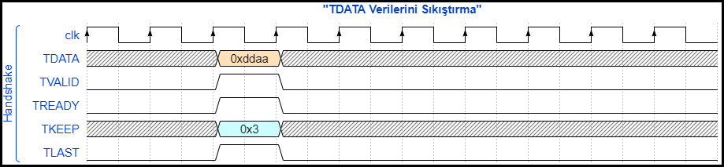

Yukarıdaki figürde, bir önceki figürdeki verilerin birleştirilmiş hali
bulunmaktadır. Bir önceki figürde **0xbb** ve **0xcc** verileri
kullanılmadığından veri birleştirilmesi yapılarak TDATA **0xddaa** olarak
gönderilir. Bu şekilde verim sağlanabilir.

- **KURAL 4: TKEEP sinyalinin TDATA ve TVALID ile aynı clock cycle içerisinde
  sürülmesi önerilir. Bu şekilde sinyali takip etmesi kolaylaşacaktır.**

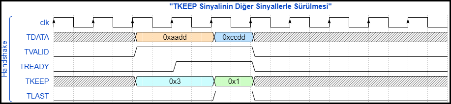

Yukarıdaki figürde TKEEP sinyali; TVALID ve TDATA sinyalleriyle beraber
sürülmüştür.

- **KURAL 5: Bir paketin son verisinin handshake durumu sonrası TKEEP, bir
  sonraki paketin ilk verisi gönderilene kadar aynı şekilde kalabilir veya
  sıfırlanabilir.**

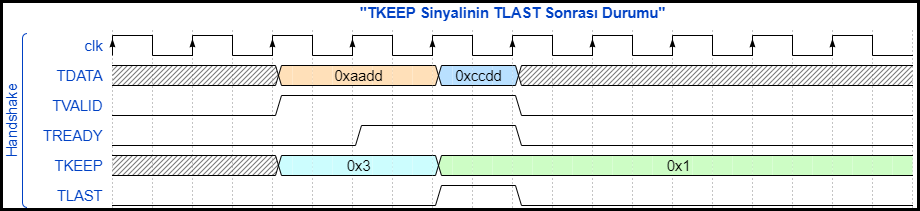

Yukarıdaki figürde TKEEP sinyali, paketin son verisinin gönderimi sonrası
durumunu korumuştur.

## TSTRB Kullanımı

TSTRB, boyut olarak TKEEP ile aynı olmasına rağmen kullanış amacı olarak; o
TSTRB bitine karşılık gelen TDATA byte'ının data byte'ı veya position byte'ı
(konum) olduğu bilgisini taşır. AXI4-Stream protokolünü yaratan Arm şirketinin
kendi sitesinde bile bu sinyalle alakalı neredeyse hiçbir bilgi veya örnek
bulunmamaktadır. Açıkçası, gördüğüm ve kullandığım hiçbir Xilinx IP'sinde bu
sinyal kullanılmıyor.

Bu sinyal TKEEP ile birlikte kullanılır. İkisinin 1/0 durumlarına göre verinin
niteliği belirlenir. Aşağıda, TKEEP ve TSTRB sinyallerinin tüm kombinasyonları
bulunmaktadır:

| TKEEP Sinyali | TSTRB Sinyali | TDATA Tipi | Açıklama |
| :-----------: | :-----------: | :--------: | :------- |
| 1             | 1             | Normal Veri | Bu kombinasyon, TDATA sinyalinin ilgili byte'ının geçerli bir veri içerdiğini tanımlar. |
| 1             | 0             | Konum Verisi | TDATA sinyalinin ilgili byte'ının göreceli bir konum bilgisi taşıdığını belirtir. Bu konum bilgisi o TDATA verisine ait bir bilgidir. |
| 0             | 0             | Geçersiz Veri | Veri veya konum bilgisi taşımaz, geçersiz veridir. TDATA sinyalinin ilgili byte kısmı kullanılmamalıdır. |
| 0             | 1             | Ayrılmış (Reserved) | Bu kombinasyon kullanılmamalıdır. |

TKEEP sinyalinde kullanılan/uygulanan kurallar TSTRB için de geçerlidir.

## TID Kullanımı

TID, kullanım alanına bağlı olarak çoğunlukla verinin geldiği yere ait özgün bir
adrestir. Kısa bir örnek olarak Xilinx'in `AXI4-Stream Switch` IP'si
verilebilir. Bu IP'de çeşitli ID/DEST adres ayarlamaları yapıldıktan sonra
değişik slave portlarına gelen veriler, ayarlanan ID/DEST bilgilerine göre
ilgili master portlarından tekrar gönderilir. Bu kısımda projenin içeriğine göre
ID bilgisi, verinin gittiği yer için önemli olabilir. Aşağıda, bu sinyale ait
çeşitli kurallar bulunmaktadır:

- **KURAL 1: TID sinyali, gönderilecek paketin ilk verisi ile birlikte
  gönderilmeye başlanır ve TLAST sürülene kadar TID değiştirilmemelidir. Ara
  kısımlarda handshake gerçekleşmese bile TID sinyalinin değiştirilmemesi,
  sinyali takip edebilmek adına önerilen bir uygulamadır.**

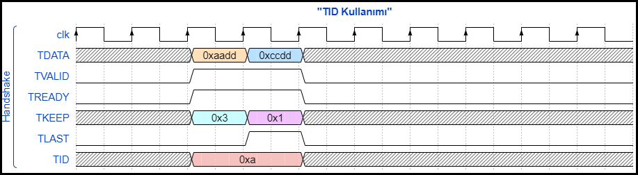

Yukarıdaki figürde paketin ilk verisinde TID sinyali sürülmüş ve TLAST 1
sürülene kadar değer değiştirilmemiştir.

- **KURAL 2: Bir paketin son verisinin handshake durumu sonrası TID, bir sonraki
  paketin ilk verisi gönderilene kadar aynı şekilde kalabilir veya
  sıfırlanabilir.**

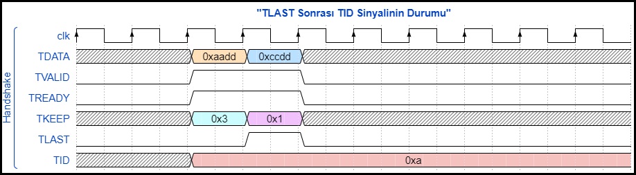

Yukarıdaki figürde, bir paketin son verisi gönderildikten sonra TID, durumunu
korumuştur, sıfırlanmamıştır.

## TDEST Kullanımı

TDEST, kullanım alanına bağlı olarak çoğunlukla verinin gideceği yere ait özgün
bir adrestir. Bu sinyalin kullanımı ve kullanım kuralları TID ile tıpa tıp
aynıdır.

## TUSER Kullanımı

TUSER sinyali, yan bir bilgi paylaşılmak isteniyorsa kullanılabilir. TDATA ile
karıştırılmamalıdır, asıl paketin verilerini taşımaz. Kullanıma göre içeriği
değişebilir.

Kullanımı ve kullanım kuralları itibariyle TID ve TDEST ile aynıdır fakat içerik
bakımından Arm bile anlaşılır bir açıklamaya yer vermemiştir.

```{warning}
TVALID sürülürken eğer başka bir sinyalin durumu değişecekse değişim TVALID ile birlikte yapılmalıdır. Bu protokol özelinde bir zorunluluk değil, öneridir. TVALID sürüldükten sonra (TREADY sinyalinin 1 olmadığı ve handshake gerçekleşmeyen durumda) diğer sinyallerde değişiklik yapmak hem kodun güvenirliğini azaltır hem de sinyallerin takip edilmesini zorlaştırır.
```

## Referanslar

- Dan Gisselquist (takma ismiyle ZipCPU), blog yazılarının bir tanesinde
  AXI4-Stream konusunda yaptığı bir
  [öneri/iyileştirmeyi](https://zipcpu.com/blog/2022/02/23/axis-abort.html )
  paylaşmıştır.
- Yine ZipCPU'nun AXI4-Stream'i debug etmek amacıyla yazdığı ayrıntılı bir
  [yazının](https://zipcpu.com/dsp/2020/04/20/axil2axis.html), protokolü
  öğrendikten sonra okunması tavsiye edilir.
- ZipCPU'nun Xilinx'in kendi oluşturduğu örnek bir kodu eleştirdiği [Twitter
  paylaşımına](https://twitter.com/zipcpu/status/1232410090537455618?lang=en)
  bakılabilir. Bu eleştiride TVALID ile birlikte sürülmeyen TLAST ile ilgili bir
  durum söz konusudur. Daha önce de belirtildiği üzere önerilen yapı, TVALID ile
  birlikte diğer sinyallerin sürülmesidir. Alakasız bir yerde herhangi bir
  sinyalin sürülmesi takip edebilme ve güvenilirlik açısından sıkıntılara yol
  açabilir. Bu noktada ZipCPU haklı bir eleştiri yapmıştır.
- Arm şirketinin AXI4-Stream ile ilgili hazırladığı bir site ve PDF var. PDF
  hali [sitenin](https://developer.arm.com/documentation/ihi0051/a?lang=en)
  sonundaki **Download** tuşu ile indirilebilir.
