# AXI4-Stream Protocol

In almost every field of engineering, data transfer from one place to another is
performed. This transfer can be done using structures we call `Bus`. In this
article, one of the bus structures of Xilinx FPGAs, the `AXI4-Stream` protocol,
will be covered.

## What is AXI4-Stream Protocol?

One of the protocols that Xilinx FPGAs use for on-chip data flow is the AXI4
protocol. This bus structure, developed under `Arm`, is very common especially
in FPGA projects containing a PS (Processing System) or Microblaze. Basically,
Arm defined three types of AXI4:

- **`AXI4-Memory Mapped (AXI4-MM):`** Compared with the others, AXI4-MM is the
  most complex bus. It contains five channels: write-data, read-data,
  write-address, read-address, and write-response. The most important difference
  from the AXI4-Lite bus structure mentioned in the next item is that it
  contains `Burst` data flow.
- **`AXI4-Lite (AXI4-L):`** Essentially the same as AXI4-MM but without burst
  transfers, so it can be defined as a simplified version of AXI4-MM. In many
  Xilinx IPs, this bus is preferred instead of AXI4-MM.
- **`AXI4-Stream (AXI4-S):`** The focus of this article. Unlike the others, this
  bus has no channels. While the other types have bidirectional data transfer,
  in this bus only unidirectional transfer exists from master side to slave
  side.

As with every bus structure, this bus also has a certain protocol flow. In all
types of AXI4 buses, there is a `master-slave` concept. In this concept, there
is a master that initiates communication and a slave that acts according to the
protocol.

Since the main focus of this article is the AXI4-Stream protocol, the following
sections are prepared accordingly. An example figure of AXI4-Stream bus is
below:

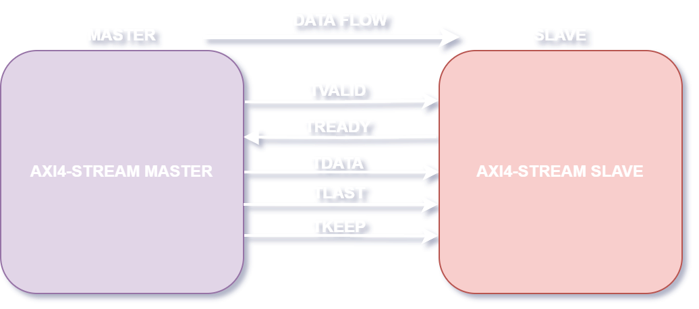

## AXI4-Stream Port Definitions

To realize the protocol, certain signal(s) must be driven by the master and
slave sides. Below is a table containing various information about each
AXI4-Stream protocol signal:

| Signal Name | Driven By | Requirement Level    | Bit Width | Definition                                                                                                                                                                                                                                                                                        |
| :---------- | :-------- | :------------------- | :-------- | :------------------------------------------------------------------------------------------------------------------------------------------------------------------------------------------------------------------------------------------------------------------------------------------------ |
| TVALID      | Master    | Strongly Recommended | 1         | Informs the slave that the master is trying to drive **valid** data.                                                                                                                                                                                                                              |
| TREADY      | Slave     | Strongly Recommended | 1         | Informs the master that the slave is ready to receive data.                                                                                                                                                                                                                                       |
| TDATA       | Master    | Strongly Recommended | 8n        | The data that the master wants to send is carried through this signal.                                                                                                                                                                                                                            |
| TLAST       | Master    | Strongly Recommended | 1         | Used on the last **TDATA** sent by the master, this signal informs the slave that the data is the last **TDATA**. The number of **TDATA** words to be sent for a packet can be one or more.                                                                                                       |
| TKEEP       | Master    | Strongly Recommended | n         | Informs the slave which **bytes** in **TDATA** signal carried by the master are **valid**. Thus, the slave knows which bytes in the incoming data to use and which to discard/not use. Its size is always one-eighth of the number of bits of the data.                                       |
| TSTRB       | Master    | Optional             | n         | Indicates whether **TDATA** bytes are data bytes or position bytes. A position byte means the relative position in the packet of **TDATA** byte pointed to by a bit in **TSTRB**. This signal can be used together with **TKEEP**. Details of their relationship will be explained later. |
| TID         | Master    | Optional             | a         | Can be defined as a unique address belonging to the master from which the data comes.                                                                                                                                                                                                             |
| TDEST       | Master    | Optional             | b         | Can be defined as a unique address belonging to the slave to which the data will go.                                                                                                                                                                                                              |
| TUSER       | Master    | Optional             | c         | As its name suggests, the user can add various side information into this signal.                                                                                                                                                                                                                 |

In the table above:

- 8n: number of data bits.
- a: `TID` bit width. In official documents, recommended maximum value is 8
  bits.
- b: `TDEST` bit width. In official documents, recommended maximum value is 4
  bits.
- c: `TUSER` bit width. In official documents, recommended maximum value is 8
  bits.

```{note}
`TSTRB`, `TID`, `TDEST`, `TUSER` signal contents may vary depending on use. Since they are not mandatory and rarely needed, most Xilinx IPs do not use them or they make them optional.
```

```{note}
One or more of the strongly recommended signals may not be used or may be left optional in some Xilinx IPs. Adding/removing them is left to the user.
```

```{note}
There is no concept of mandatory signals within the standard. In other words, in any project, signals like TVALID, TDATA, TREADY may not be used. Therefore, in the table above, important signals are defined as strongly recommended, not mandatory.
```

```{note}
TDATA width is given as 8n and TKEEP width as n, but if TDATA is not a multiple of 8, then TKEEP is found by dividing TDATA width by 8 and rounding up. For example, if TDATA is 22 bits, TKEEP = ceil(22/8) = 3.
```

In the following sections, how AXI4-Stream signals should be driven will be
explained.

## TVALID-TREADY Usage and Handshake Process

As understood from the table in the previous section, the master drives TVALID
signal to the slave side, and the slave drives TREADY signal to the master side.
There is a certain protocol to follow when driving these two signals. This is
called `Handshake`. As the name suggests, thanks to this process, the master and
slave “shake hands,” and as a result of this handshake, data transfer from the
master to the slave takes place.

The basic rule in the handshake protocol is that when TVALID and TREADY signals
are `high` (value **1**) in the same clock cycle, the slave detects this and can
use TDATA information coming from the master.

At this point, there are some basic rules related to driving TVALID and TREADY
signals:

- **RULE 1:** When the master will drive the data, it must never ever wait for
  TREADY signal to be 1. When it is ready to send data, it must drive the data
  onto the TDATA signal and drive TVALID signal to 1 in the same clock cycle. In
  short; TVALID must not wait for TREADY to be 1. This situation is related to
  `Rule 3`.

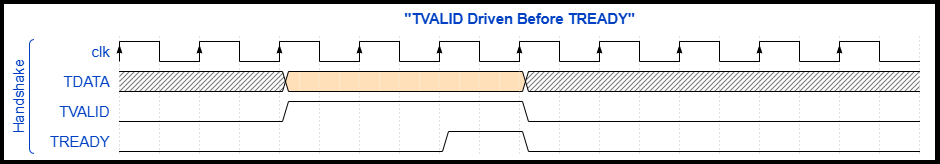

In the figure above, TVALID signal and TDATA are driven without waiting for
TREADY, and when TREADY becomes 1, the handshake is realized. Since no other
data is ready, TVALID signal is set to 0. In the striped parts of TDATA signal,
data is not yet ready.

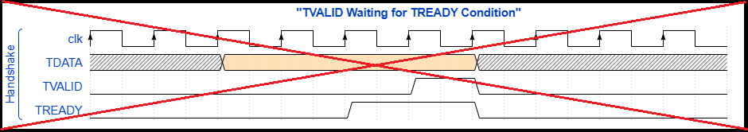

In the figure above, although there is data ready to be sent in TDATA, TVALID is
not driven to 1 and instead waits for TREADY. This situation is wrong and
against the protocol.

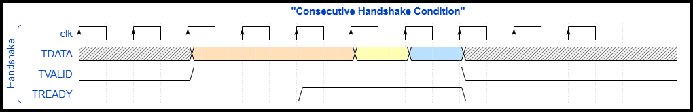

Above is a figure of successive handshakes. After one handshake, because the
next data is immediately ready, two more handshakes occur. In this way,
efficiency may be increased.

- **RULE 2:** After the master drives TVALID and TDATA signals, they must not be
  changed until handshake occurs.

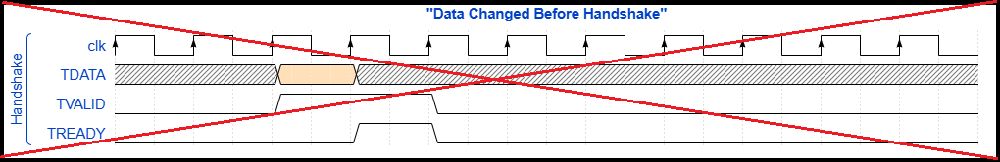

In the figure above, although TVALID = 1 and TDATA is driven with ready data,
TDATA is changed before handshake. This is wrong and against the protocol,
because after being driven with TVALID, TDATA must not change until handshake
occurs.


In the figure above, although TVALID = 1 and TDATA is driven with ready data,
TVALID is again driven to 0 before handshake occurs. This is wrong and against
the protocol, because after TVALID is driven to 1, it must not change until
handshake occurs.

- **RULE 3:** The slave side may freely drive TREADY signal. It may wait for
  TVALID = 1, or it may drive 1 without waiting for TVALID.

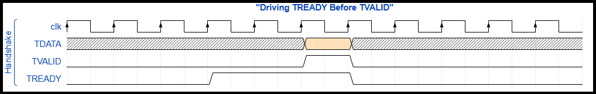

In the figure above, TREADY is driven to 1 before TVALID.

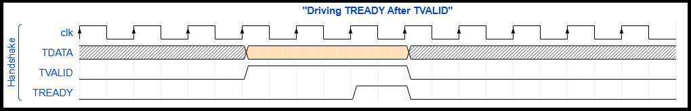

In the figure above, TREADY is driven to 1 after TVALID.

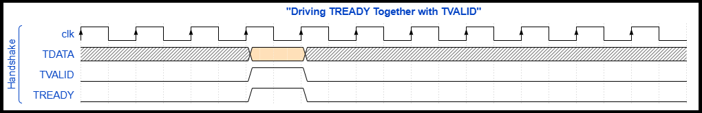

In the figure above, TREADY is driven to 1 together with TVALID.

- **RULE 4:** A TREADY signal driven to 1 by the slave may be driven back to 0
  before handshake occurs.

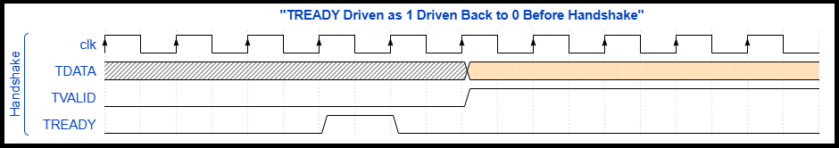

In the figure above, before handshake occurs, TREADY is driven to 1 and then
back to 0. This situation is not a problem.

- **RULE 5:** After handshake, TREADY signal driven by the slave may remain 1.

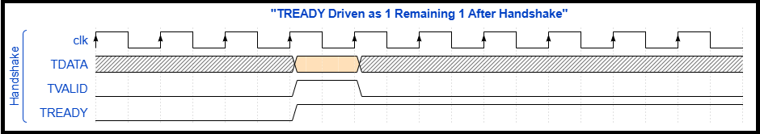

In the figure above, after handshake, TREADY is left as 1. This situation is not
a problem.

- **RULE 6:** If after handshake no new handshake or data transfer will happen,
  TDATA may remain in its last state; it is not mandatory to reset it.

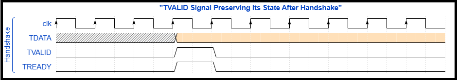

In the figure above, after handshake, TDATA preserved its state, i.e., no reset
operation was performed.

As mentioned before, handshake is the most important element of AXI4-Stream
protocol to pay attention to. As long as the steps mentioned above are followed,
there will be no error in terms of protocol.

## TLAST Usage

TLAST signal is used to indicate the last data in a packet. Below are various
rules regarding the use of TLAST:

- **RULE 1:** In packets larger than TDATA width, TLAST must be 1 in the
  handshake of the last data sent.

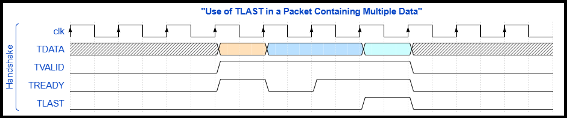

In the figure above, transmission of a packet containing 3 TDATA data from
master to slave is shown. In the last TDATA cycle of the packet, TLAST is driven
to 1.

- **RULE 2:** Even if there is only one data word in the packet, TLAST can be
  used. In this case, TLAST must be driven to 1 in each handshake.

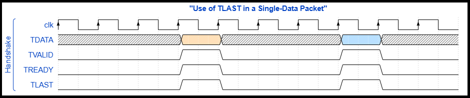

In the figure above, the data packet is large enough for one handshake.
Therefore, in each packet transmission, TLAST is driven as 1.

- **RULE 3:** It is recommended to drive TLAST in the same clock cycle with the
  last TDATA and TVALID. In this way, following the signal becomes easier.

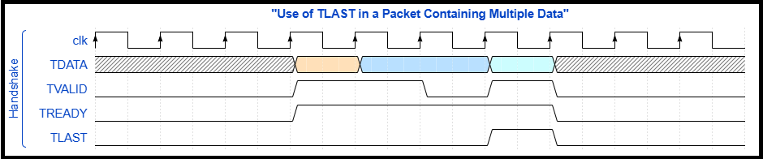

In the figure above, after 2 handshakes, in one clock cycle TVALID could not be
driven to 1. While driving the last data and TVALID, TLAST is also driven to 1.

- **RULE 4:** After the handshake of the last data, TLAST may remain 1 or 0
  until the first data of the next packet is sent. If the next packet is larger
  than TDATA width and TLAST remains 1 until the first handshake of the next
  packet, it must be ensured that TLAST is driven to 0 during the handshake.

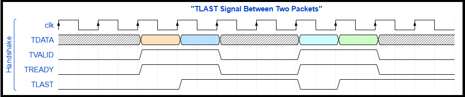

In the figure above, after packet transmission ended, TLAST remained 1 until the
first data of the next packet. In the first data of the second packet, it was
driven to 0 again.

## TKEEP Usage

TKEEP signal carries information about which byte(s) of TDATA signal in the
protocol are valid. Therefore, it is always one-eighth of TDATA width. For
example; in a scenario where TDATA signal is 16 bits, TKEEP must be driven as 2
bits. In this case, if during handshake TKEEP is **"0b01"** on the slave side,
the most significant 8 bits of TDATA signal are invalid and must not be used.
Below are various rules regarding TKEEP signal:

- **RULE 1:** Any bit of TKEEP signal makes the corresponding byte of TDATA
  signal valid or invalid.

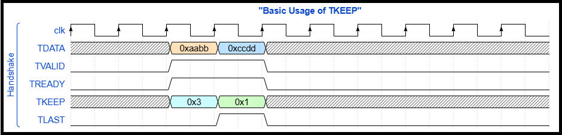

In the figure above, since TKEEP signal of the first data sent is **0x3**, the
slave must accept all of this data. Since TKEEP signal of the last data is
**0x1**, the most significant 8 bits of TDATA are invalid and must not be used.
In the last TDATA, only **0xdd** is valid, **0xcc** must not be used.

- **RULE 2:** TKEEP signal may contain 0 bits even if TLAST = 0. There is no
  rule forbidding TKEEP from containing 0 unless TLAST = 1. Also, any bit of
  TKEEP signal may be 0.

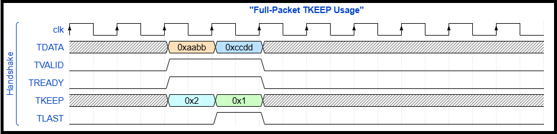

In the figure above, in both data of the transmitted packet, certain parts of
TDATA are invalid. The **0xbb** part of the first data and **0xcc** part of the
second data are invalid. Also, as seen, any bit of TKEEP signal may be 0, there
is no restriction.

- **RULE 3:** The contents of TKEEP may be all 0 in all data of the packet, but
  Arm does not prefer this in its resources. In such cases, the packet data is
  usually aligned as much as possible. In this way, efficiency is aimed to be
  increased. As a result, typically only the last data of the packet may have 0
  in TKEEP.

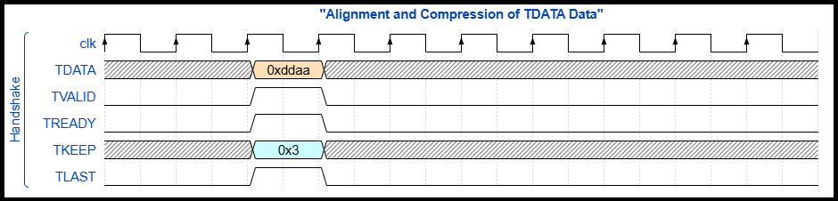

In the figure above is the merged version of the data in the previous figure.
Since **0xbb** and **0xcc** were not used, data was merged and TDATA sent as
**0xddaa**. Thus, efficiency may be achieved.

- **RULE 4:** It is recommended to drive TKEEP in the same clock cycle with
  TDATA and TVALID. In this way, following the signal becomes easier.

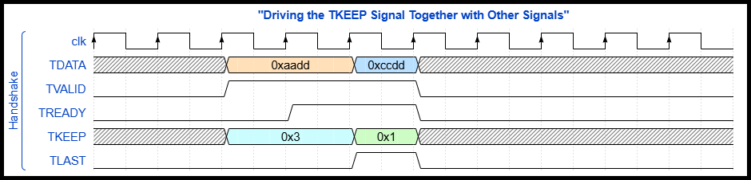

In the figure above, TKEEP is driven together with TVALID and TDATA.

- **RULE 5:** After handshake of the last data of a packet, TKEEP may remain
  unchanged until the first data of the next packet is sent, or it may be reset.

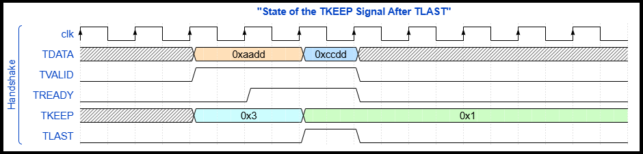

In the figure above, after transmission of the last data of the packet, TKEEP
preserved its state.

## TSTRB Usage

Although TSTRB has the same width as TKEEP, its purpose is to indicate whether
TDATA byte corresponding to that TSTRB bit is a data byte or a position byte.
Even on the website of Arm, which created AXI4-Stream protocol, there is almost
no information or example about this signal. Honestly, in none of the Xilinx IPs
I have seen or used is this signal utilized.

This signal is used together with TKEEP. Depending on their 1/0 states, the
nature of the data is determined. Below are all combinations of TKEEP and TSTRB
signals:

| TKEEP | TSTRB |   TDATA Type  | Explanation                                                                                                                                     |
| :---: | :---: | :-----------: | :---------------------------------------------------------------------------------------------------------------------------------------------- |
|   1   |   1   |  Normal Data  | This combination defines that the corresponding byte of TDATA signal contains valid data.                                                   |
|   1   |   0   | Position Data | Indicates that the corresponding byte of TDATA signal carries relative position information. This position info belongs to that TDATA data. |
|   0   |   0   |  Invalid Data | Carries no data or position information, invalid data. That part of TDATA must not be used.                                                     |
|   0   |   1   |    Reserved   | This combination must not be used.                                                                                                              |

Rules applied to TKEEP also apply to TSTRB.

## TID Usage

TID is, depending on the area of use, mostly a unique address belonging to where
the data comes from. As a brief example, Xilinx’s `AXI4-Stream Switch` IP can be
given. In this IP, after various ID/DEST address settings are made, data
arriving at different slave ports is resent from the relevant master ports
according to the configured ID/DEST information. In this part, depending on the
content of the project, the ID information may be important for where the data
goes. Below are various rules regarding this signal:

- **RULE 1: TID signal starts to be sent together with the first data of the
  packet to be sent, and TID must not be changed until TLAST is driven. Even if
  a handshake does not occur in intermediate parts, not changing TID signal is a
  recommended practice in order to be able to track the signal.**

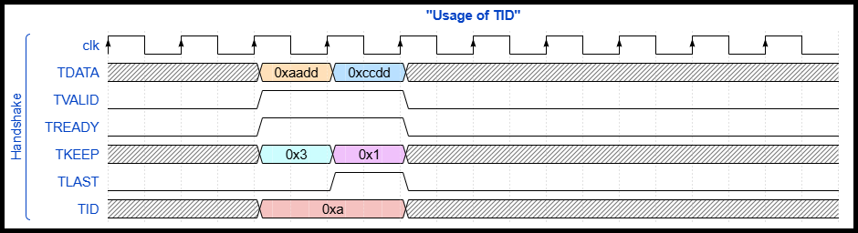

In the figure above, in the first data of the packet TID signal is driven, and
its value is not changed until TLAST is driven to 1.

- **RULE 2: After the handshake of the last data of a packet, TID may remain the
  same until the first data of the next packet is sent, or it may be reset.**

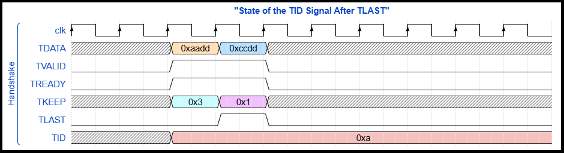

In the figure above, after the last data of a packet is sent, TID preserved its
state; it was not reset.

## TDEST Usage

TDEST is, depending on the area of use, mostly a unique address belonging to
where the data will go. Usage and usage rules of this signal are exactly the
same as TID.

## TUSER Usage

TUSER signal can be used if side information is to be shared. It must not be
confused with TDATA; it does not carry the main data of the packet. Its content
may vary depending on the use.

In terms of usage and usage rules, it is the same as TID and TDEST, but
regarding content even Arm has not provided a clear explanation.

```{warning}
While TVALID is being driven, if the state of another signal will change, the change should be made together with TVALID. This is not an obligation specific to this protocol, but a recommendation. After TVALID is driven (in the case where TREADY signal is not 1 and handshake has not occurred), making changes in other signals both reduces the reliability of the code and makes it harder to track the signals.
```

## References

- Dan Gisselquist (a.k.a. ZipCPU) shared a
  [suggestion/improvement](https://zipcpu.com/blog/2022/02/23/axis-abort.html)
  regarding AXI4-Stream in one of his blog posts.
- Again, a detailed [article](https://zipcpu.com/dsp/2020/04/20/axil2axis.html)
  written by ZipCPU to debug AXI4-Stream is recommended to be read after
  learning the protocol.
- ZipCPU’s [Twitter
  post](https://twitter.com/zipcpu/status/1232410090537455618?lang=en)
  criticizing an example code created by Xilinx can be checked. In this
  criticism there is a situation related to TLAST not being driven together with
  TVALID. As mentioned before, the recommended structure is to drive other
  signals together with TVALID. Driving any signal in an unrelated place may
  cause difficulties in tracking and reliability. At this point ZipCPU made a
  justified criticism.
- Arm has a site and a PDF prepared about AXI4-Stream. The PDF version can be
  downloaded via the **Download** button at the end of [the
  site](https://developer.arm.com/documentation/ihi0051/a?lang=en).
