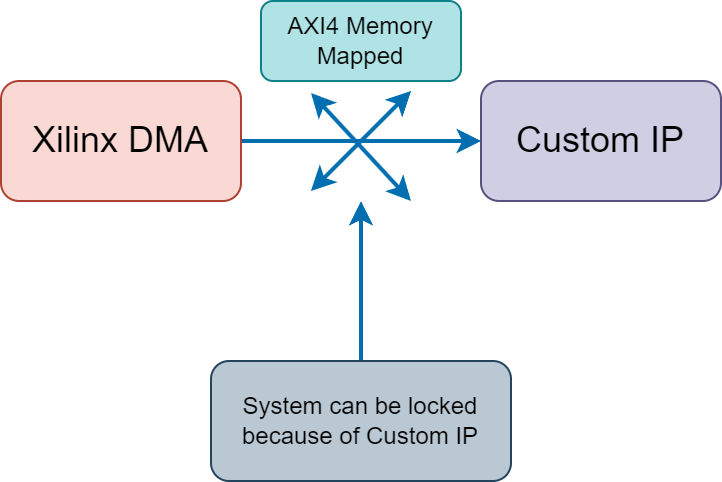
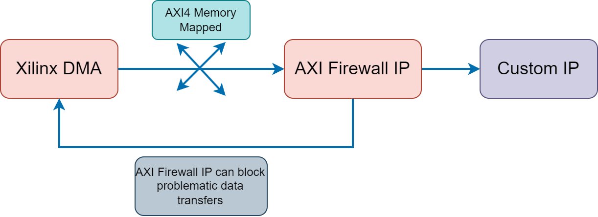
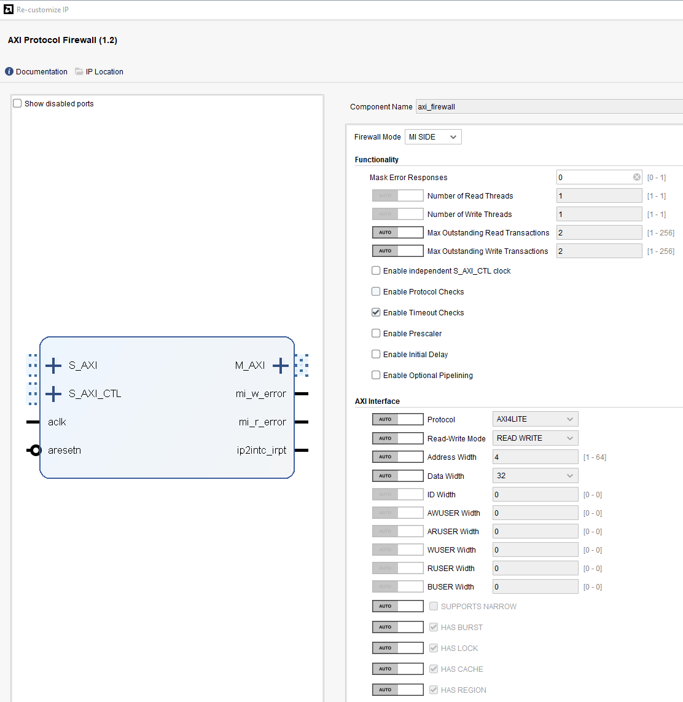
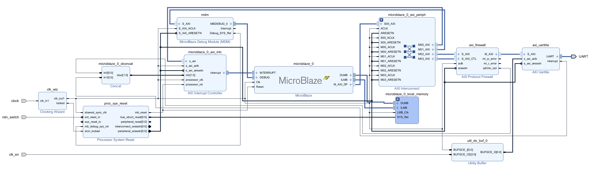
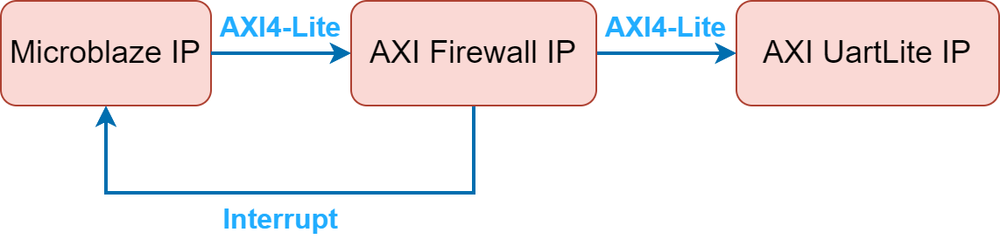
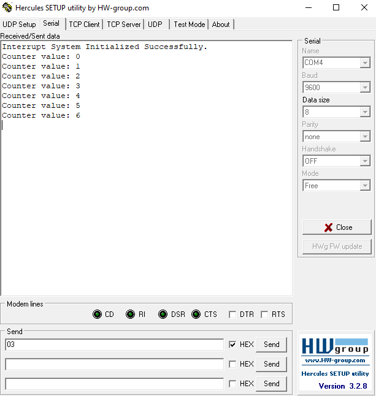
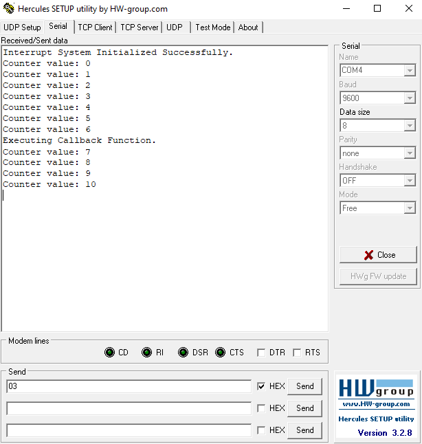

# Xilinx AXI Protocol Firewall IP

Purpose of this document is to introduce Xilinx AXI Firewall IP and demonstrate `Timeout Protection (Enable Timeout Checks)` feature with an example project. First, let's briefly describe AXI Firewall IP.

## Purpose of AXI Firewall IP

AXI Firewall IP serves as a critical bridge during AXI interface data transfers, preventing problems caused by erroneous transfers from affecting other project components. `Firewall` literally means `Security Barrier`. IP supports AXI3, AXI4, and AXI4-Lite interfaces.

For example, consider using a DMA (Direct Memory Access) IP. DMA IP transfers data via AXI interface to a custom-designed IP. If a protocol error occurs or custom IP becomes unresponsive, entire DMA-connected data path may lock. A figure illustrating this scenario:



In such a case, AXI Firewall detects and stops erroneous transfer. Firewall actively monitors AXI traffic between master and slave interfaces, checking for protocol violations or timeouts, and blocks problematic transfers. Example figure below:



As seen above, AXI Firewall IP ensures rest of project continues functioning unaffected. Essentially, AXI Firewall serves as security barrier on AXI data path, preventing issues from propagating to other parts.

## General Features of AXI Firewall IP

Key general features of AXI Firewall IP listed below. IP includes a register map controlled via AXI4-Lite interface. Register map AXI4-Lite interface and firewall AXI4-Lite interface are different:

* AXI3/AXI4/AXI4-Lite support: Supports multiple AXI interfaces.
* Timeout protection: Identifies transfers that exceed expected completion times.
* Protocol violation protection: Stops erroneous transfers due to AMBA/AXI protocol violations (unexpected signals or handshakes).
* AXI4-Lite Register Stop/Start: Manually start/stop IP via AXI4-Lite registers.
* AXI4-Lite Register Status/Interrupt: Maintains status information for blocked errors. Interrupt enable/disable is available. IP has also interrupt port.

## AXI Firewall IP Settings

Below are IP settings for version 1.2:



Under `AXI Interface`, specific AXI settings are configured.

Below, certain settings under `Functionality` are detailed separately. AXI Firewall IP can operate on `Master` or `Slave` interfaces.

### Number of Read Threads

Defines maximum simultaneous read operations. Useful in multi-threaded read systems.

### Number of Write Threads

Defines maximum simultaneous write operations. Useful in concurrent data writing applications.

### Max Outstanding Read Transactions

Limits maximum read transactions awaiting responses. Simplifies memory access management.

### Max Outstanding Write Transactions

Limits maximum write transactions awaiting responses. Prevents overload in heavy data write systems.

### Enable independent S_AXI_CTL clock

Activates separate clock domain for AXI4-Lite register interface (S_AXI_CTL). Disabled means IP uses single `aclk` domain.

### Enable Protocol Checks

Ensures AXI transfers follow AMBA/AXI protocol rules. Stops transfers on violations, protecting overall functionality.

Example: No response to read request or incorrect address is considered violation.

### Enable Timeout Checks

Monitors transfer completion times. If enabled, checks each transfer against configured timeout period (set via AXI4-Lite registers). Failure to complete in time considered an error, blocking affected transfer but allowing rest of system traffic.

This feature is demonstrated in demo project with interrupt interface (using callback functions).

### Enable Prescaler

Expands timeout counter increments, counting every (n+1) cycles for prescaler value n. Set via AXI4-Lite registers. Useful for very long timeout durations.

### Initial Delay

Specifies delay (in clock cycles) after reset before timeout counters start. Set via AXI4-Lite registers. Useful for FPGA stabilization after startup.

### Enable Optional Pipelining

Allows pipeline insertion into IP. Improves signal transmission speed and stabilizes design at high clock frequencies. Increases FPGA resource usage.

## Demo Project

Demo shows AXI Firewall IP’s timeout functionality on Basys3 FPGA board. Goal is to demonstrate IP’s capability in critical scenarios and system stability preservation.

Project block design image is given:



### General Project Structure

Digilent Basys3 FPGA is utilized. Two critical input signals `clk_en` and `rstn_switch` connected to physical switches. `rstn_switch` acts as active-low system reset. `clk_en` toggles clock connected to `AXI UartLite IP`.

System includes MicroBlaze IP, AXI Firewall IP, and AXI UartLite IP. MicroBlaze continuously sends data via UART once per second using Vitis software. AXI Firewall monitors this AXI protocol data transfer, checking for timeout conditions. Basic project architecture is provided:



Also, resource usage of Firewall IP on FPGA is presented below:

- 676 LUTs
- 677 FFs
- 1 LUTRAM

### Demo Scenario

Initially, MicroBlaze interrupt is enabled and callback is registered in Vitis code. AXI Firewall interrupts are also activated.

Scenario executed:

* After startup (MicroBlaze is ready), UART data regularly transmitted. Firewall IP quietly monitors.
* Setting FPGA **clk_en** switch to 0 stops clock to AXI UartLite module, halting UART function and preventing AXI transactions.
* AXI Firewall triggers timeout mechanism, generating interrupt signal to MicroBlaze IP.
* Interrupt triggers callback function in MicroBlaze. Callback performs actions like halting AXI transfers, re-enabling Firewall IP (via `MI-Side Unblock Control Register` set to 1).
* Callback repeatedly triggered if timeout persists. Resolving requires setting `clk_en` switch back to 1.

Relevant callback function is provided below:

```c
// Callback Function
void MyInterruptHandler() {
    // Enable Firewall
	Xil_Out32(XPAR_AXI_FIREWALL_0_BASEADDR + 0x8, 0x1);

    // Print
    xil_printf("Executing Callback Function.\r\n");

    // Wait for a while
    sleep(1);
}
```

### Running Demo Project

After uploading code to board via Vitis, open `Hercules` and connect to UART Com port. A counter begins counting as below:



At exact moment `Counter value: 6` appears, switch defined as `clk_en` is set to position 0, shown in image below. After this scenario, no data can be written to Hercules because system continually triggers callback.


After setting `clk_en` switch back to position 1, code continues from where it stopped:



## Final Notes

This demo clearly highlights critical importance of AXI Firewall IP for system security. Prevents issues like timeout from escalating into larger system problems, ensuring continuous and secure operation.

Through this application, it becomes clear that timeout checks provided by AXI Firewall IP offer practical solutions to real-world problems we might encounter.
