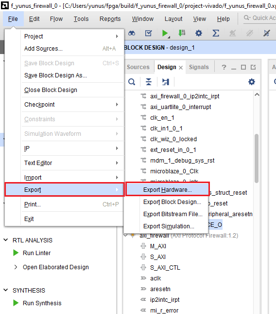

# Vivado Projesinin Oluşturulması

Projeyi en baştan  oluşturmak için `fusesoc` kütüphanesi kullandım. FPGA projesinin fusesoc ile oluşturulabilmesi için aşağıdaki tool ve kütüphanelere ihtiyaç var:

- Vivado 2024.1
- pip
- make
- fusesoc

## Proje Oluşturma Aşamaları

İlk olarak indirilen repo'nun `fpga` dosyası içerisinde terminal (Linux) veya cmd (Windows) açılır. Sonrasında Vivado source edilir (örnek Windows için verilmiştir). Vivado'nun source edilebilmesi için kurulum dizini içerisinde `settings64.bat` aranmalıdır.

```bash
D:\Xilinx\Vivado\2024.1\settings64.bat
```

Sonrasında aşağıdaki iki komut kullanılarak projeyi oluşturmak için kullanılacak make dosyaları oluşturulur.

```bash
fusesoc library add firewall .
fusesoc run --target=project --setup firewall
```

Oluşturulan build dosyasının içindeki dosyalara `cd` komutu ile gidilir ve `Makefile` dosyasının olduğu dizinde durulur. Yani `build\f_yunus_firewall_0\project-vivado` içerisine girilmelidir. Aşağıdaki komut ile Vivado projesi GUI üzerinden açılır.

```bash
make build-gui
```

Bu noktadan sonra FPGA projesi sentezlenebilir. FPGA sentezi sonrası eğer Vitis projesi oluşturulacak ise `.xsa` dosyası export edilmelidir. Bunun için aşağıdaki figürde belirtilen seçeneğe tıklanır.



Sonrasında `Output` ayarları içerisinde `Include Bitstream` seçeneği seçilir ve export dizini olarak `sw` dosyasının içi seçilmelidir. Ayrıca isim olarak `design_1_wrapper.xsa` seçilmelidir.

## Notlar

Windows'ta yaparken projenin oluştuğu dizinin uzunluğu önemli. Belli bir karakter sayısı aşıldığında proje açılsa da doğru bir şekilde sentezlenmeyebilir. Böyle bir durumda oluşturulan proje daha kısa bir dizine kopyalanabilir. Veya `build` ve içindeki dosya isimlerinin ismi kısaltılabilir.
