# Clock Muxes

There are several methods to implement clock muxing. The mux operation can be performed for both asynchronous and synchronous clocks. In some designs, special care must be taken to avoid glitches during muxing. Therefore, this document covers different clock mux techniques and their characteristics.

A glitch can be defined as an unwanted short pulse that may occur during clock muxing. If clock switching is not properly controlled, glitches may occur, leading to problems in setup and hold timing. This can also affect the operation of the design.

In all testbenches, two different clocks are generated at 50 MHz and 75 MHz. These can be considered asynchronous.

## Mux Design Using Code

### Design With Potential Glitch

In this design, clock switching is done combinatorially without any control logic. Below is the code snippet:

```verilog
module user_glitch_mux(
        input   aclk_in1,
        input   aclk_in2,
        output  aclk_out,
        input   selection
    );

    assign  aclk_out    =   !selection  ?   aclk_in1    :   aclk_in2;

endmodule
```

When tested in a testbench, the following glitch may occur:

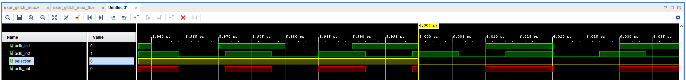

### Glitch-Free Design

The glitch-free design is based on the structure described [in this link](https://vlsitutorials.com/glitch-free-clock-mux/). Here, the `selection` signal is synchronized to both clock domains using 2-stage flip-flops. Clock muxing is then based on the synchronized outputs, enabling glitch-free operation. The code snippet is provided below:

```verilog
module user_glitchless_mux(
        input   aclk_in1,
        input   aclk_in2,
        output  aclk_out,
        input   selection
    );

    // Clock domain synchronization flip-flops for clock domain 1
    reg sel_sync_ff1_clk1 = 1'b0;
    reg sel_sync_ff2_clk1 = 1'b0;

    // Clock domain synchronization flip-flops for clock domain 2
    reg sel_sync_ff1_clk2 = 1'b0;
    reg sel_sync_ff2_clk2 = 1'b0;

    // Synchronization logic for clock domain 1
    always @(posedge aclk_in1) begin
        sel_sync_ff1_clk1 <= !sel_sync_ff2_clk2 && !selection;
        sel_sync_ff2_clk1 <= sel_sync_ff1_clk1;
    end

    // Synchronization logic for clock domain 2
    always @(posedge aclk_in2) begin
        sel_sync_ff1_clk2 <= !sel_sync_ff2_clk1 && selection;
        sel_sync_ff2_clk2 <= sel_sync_ff1_clk2;
    end

    // Output logic
    assign aclk_out = (sel_sync_ff2_clk1 && aclk_in1) || (sel_sync_ff2_clk2 && aclk_in2);

endmodule
```

When tested in a testbench, a glitch-free result is observed:

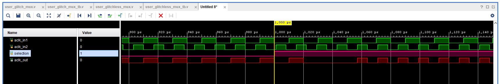

## Mux Design Using Xilinx Primitives

For demonstration, the Basys-3 (Artix-7) board is used. Hence, this section focuses on clock muxes available in Xilinx for the 7-series family. These clock muxes use the `BUFGCTRL` primitive under the hood. Depending on how the ports of this primitive are driven, the design may or may not be glitch-free.

The ports of this primitive and their functions are described below (values marked with **x** represent binary values):

| Port Name | Description |
| :-------- | :---------- |
| CEx       | Clock enable signal for Ix clock input. Functionally similar to the Sx port. Requires setup/hold timing; failing to meet it may cause glitches. For this article, timing is assumed to be met. If the selection signal is connected to this port, SEx should be driven high. |
| SEx       | See the description of CEx. |
| IGNOREx   | If set to 1, switching happens immediately, potentially causing glitches. |
| Ix        | Specifies the clock signals. |
| O         | Clock output. |

### BUFGMUX_CTRL

This library from Xilinx guarantees a glitch-free design. The code snippet using this primitive is shown below:

```verilog
module user_bufgmux_ctrl(
        input   aclk_in1,
        input   aclk_in2,
        output  aclk_out,
        input   selection
    );

   BUFGMUX_CTRL BUFGMUX_CTRL_inst (
      .O    ( aclk_out  ),
      .I0   ( aclk_in1  ),
      .I1   ( aclk_in2  ),
      .S    ( selection )
   );

endmodule
```

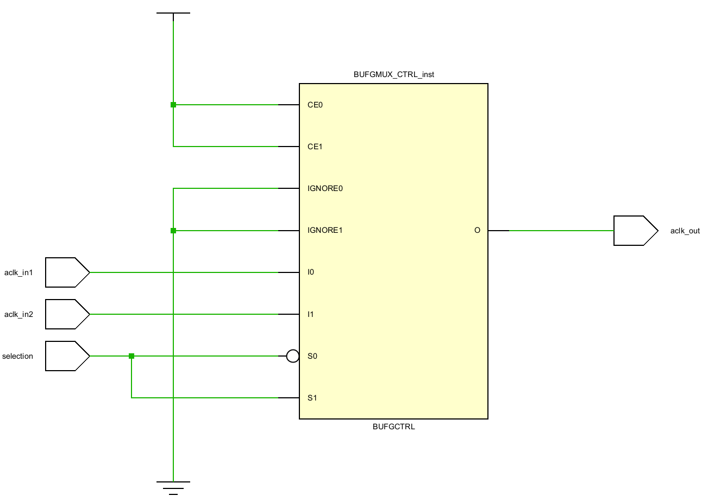

Result when tested in a testbench:

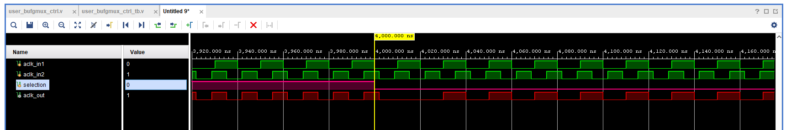

### BUFGMUX

This primitive also guarantees glitch-free operation. Below is the code:

```verilog
module user_bufgmux(
        input   aclk_in1,
        input   aclk_in2,
        output  aclk_out,
        input   selection
    );

   BUFGMUX #(
   )
   BUFGMUX_inst (
      .O    ( aclk_out  ),
      .I0   ( aclk_in1  ),
      .I1   ( aclk_in2  ),
      .S    ( selection )
   );

endmodule
```

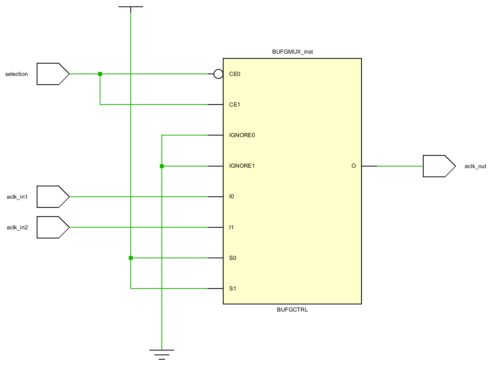

Testbench result:

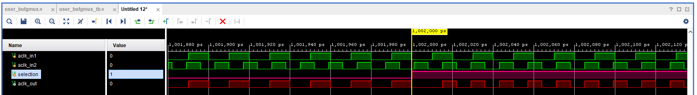

### BUFGMUX1

This primitive does guarantee glitch-free operation, but behaves differently compared to others. As shown in the visuals, although the clock high time varies when `selection` toggles, it doesn't produce pulses that are categorized as glitches. This is due to its unique truth table. Unlike BUFGMUX and other glitch-free methods, which holds the output low during clock transitions, BUFGMUX_1 maintains the output high until the new clock input is selected. This behavior is particularly useful in designs where a high output state is preferred during switching. Code snippet:

```verilog
module user_bufgmux1(
        input   aclk_in1,
        input   aclk_in2,
        output  aclk_out,
        input   selection
    );

   BUFGMUX_1 #(
   )
   BUFGMUX_1_inst (
      .O    ( aclk_out  ),
      .I0   ( aclk_in1  ),
      .I1   ( aclk_in2  ),
      .S    ( selection )
   );

endmodule
```

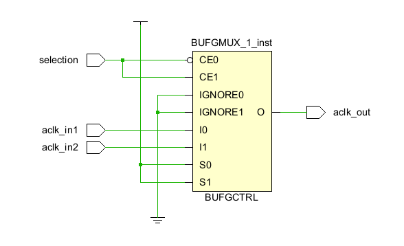

Test result:

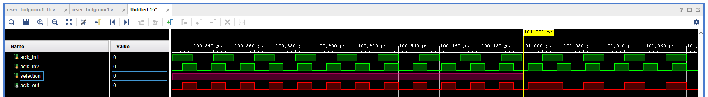

### BUFGCTRL

This primitive offers full control over all ports and allows both glitchy and glitch-free designs.

#### Glitchy BUFGCTRL Design

This design does not guarantee glitch-free operation. Code snippet:

```verilog
module user_glitch_bufgctrl(
        input   aclk_in1,
        input   aclk_in2,
        output  aclk_out,
        input   selection
    );

   BUFGCTRL #(
      .INIT_OUT     ( 0         ),
      .PRESELECT_I0 ( "FALSE"   ),
      .PRESELECT_I1 ( "FALSE"   )
   )
   BUFGCTRL_inst (
      .O        ( aclk_out      ),
      .CE0      ( 1'b1          ),
      .CE1      ( 1'b1          ),
      .I0       ( aclk_in1      ),
      .I1       ( aclk_in2      ),
      .IGNORE0  ( 1'b1          ),
      .IGNORE1  ( 1'b1          ),
      .S0       ( !selection    ),
      .S1       ( selection     )
   );

endmodule
```

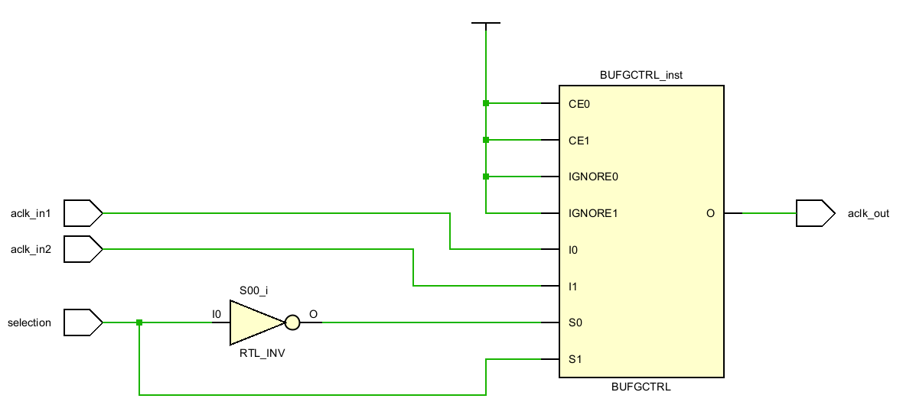

Result:

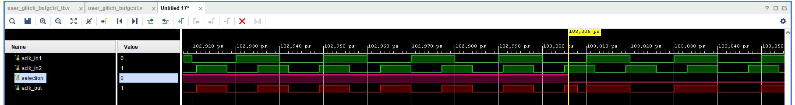

#### Glitch-Free BUFGCTRL Design

This guarantees glitch-free operation. Code snippet:

```verilog
module user_glitchless_bufgctrl(
        input   aclk_in1,
        input   aclk_in2,
        output  aclk_out,
        input   selection
    );

   BUFGCTRL #(
      .INIT_OUT     ( 0         ),
      .PRESELECT_I0 ( "FALSE"   ),
      .PRESELECT_I1 ( "FALSE"   )
   )
   BUFGCTRL_inst (
      .O        ( aclk_out      ),
      .CE0      ( !selection    ),
      .CE1      ( selection     ),
      .I0       ( aclk_in1      ),
      .I1       ( aclk_in2      ),
      .IGNORE0  ( 1'b0          ),
      .IGNORE1  ( 1'b0          ),
      .S0       ( 1'b1          ),
      .S1       ( 1'b1          )
   );

endmodule
```

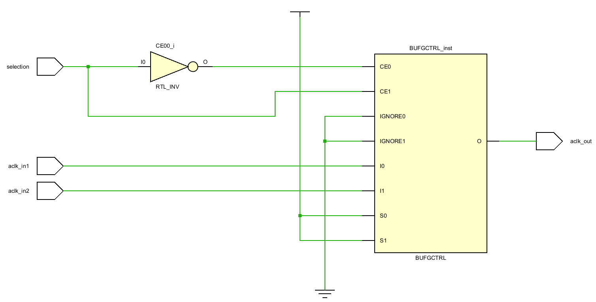

Result:

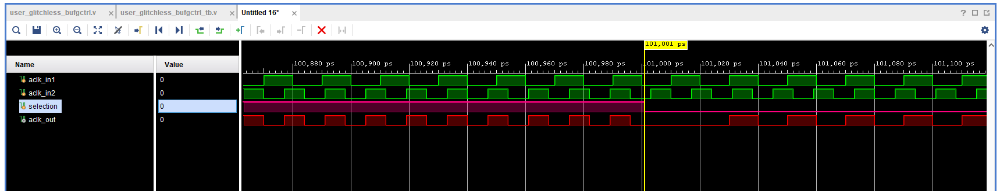

## Testing All Mux Designs via Chipscope and Testbench

The following block design was used to test all clock muxes via both testbench and chipscope. To capture glitches, a 200 MHz clock was assigned to the ILA. Two clocks for muxing are generated at 10 MHz and 25 MHz using different clocking wizards with different phases.

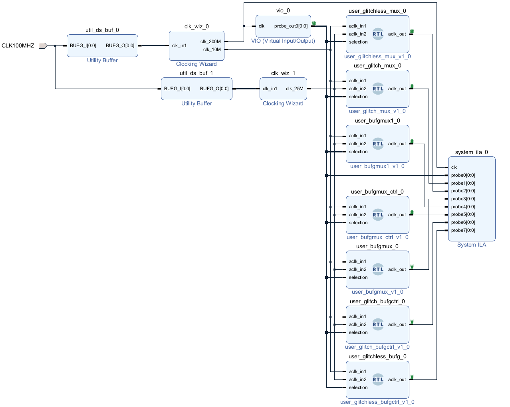

Testbench results:

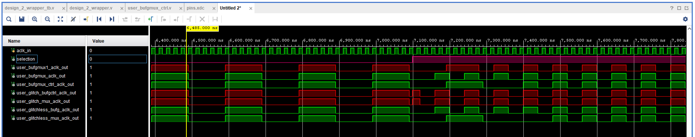

Results captured via ILA:

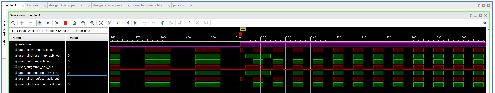

## Final Notes

To implement glitch-free mux designs, consider the following:

- Glitch-Free Mux Design via Code
- BUFGMUX
- BUFGMUX1
- BUFGMUX_CTRL
- Glitch-Free BUFGCTRL

Other designs that do not guarantee glitch-free operation:

- Glitchy Mux Design via Code
- Glitchy BUFGCTRL Design

Additionally, Xilinx confirms in `UG472` that the following are guaranteed to be glitch-free:

- Glitch-Free BUFGCTRL
- BUFGMUX_CTRL

Also, the following are glitch-free **if** setup/hold timing is met:

- BUFGMUX
- BUFGMUX1

Finally, setting the `IGNOREx` ports to 1 disables glitch protection.

## References

- [Clock Mux-1](https://vlsiuniverse.blogspot.com/2017/03/clock-multiplexer.html)
- [Clock Mux-2](https://www.intel.com/content/www/us/en/docs/programmable/683082/22-3/clock-multiplexing.html)
- [Clock Mux-3](https://www.eetimes.com/techniques-to-make-clock-switching-glitch-free/)
- [Clock Mux-4](https://vlsitutorials.com/glitch-free-clock-mux/)
- [Clock Mux-5](https://www.fpgadeveloper.com/2011/09/code-templates-clock-mux.html/)
