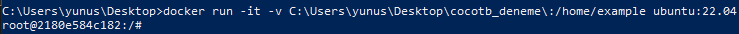
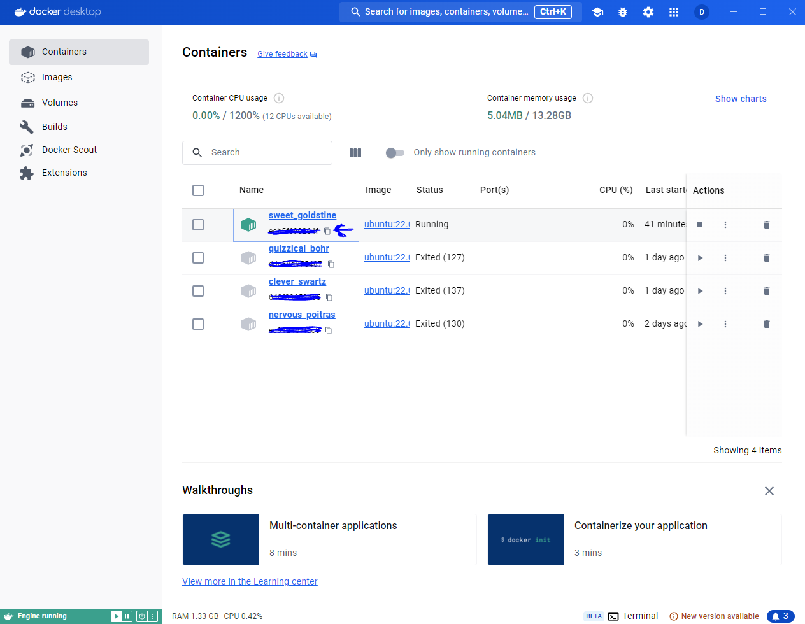
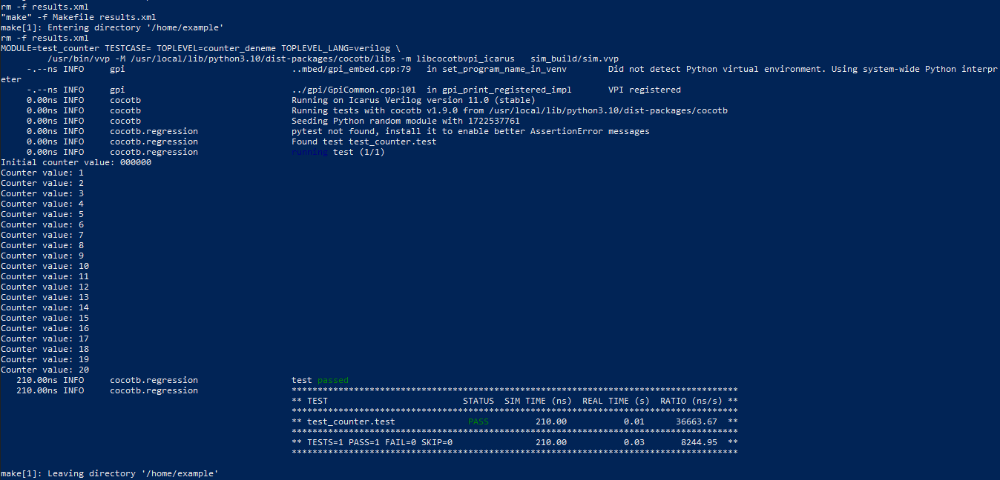
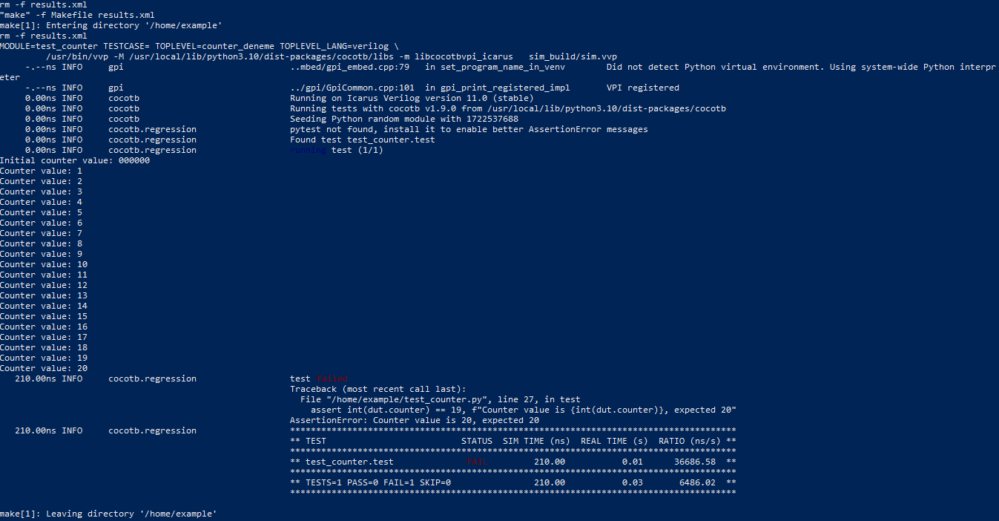
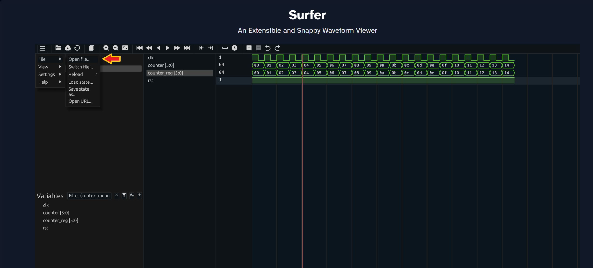

# COCOTB (Coroutine Based Cosimulation Test Bench)

Verification, debugging, testing... In FPGA design, simply writing RTL code and expecting it to work is very difficult. It's not impossible to run a code in one go, but ensuring that the code works in corner-case scenarios is an additional challenge.

The steps we take before performing real-time tests on an FPGA board are crucial for achieving this: Verifying code and iteratively correcting it. This is what we refer to as RTL verification.

A popular method in verification is UVM, but in this article, I will talk about `cocotb`, a Python-based framework. Yes, I'm not talking about verification using Verilog, SystemVerilog, or VHDL. With `cocotb`, you can freely verify your RTL design entirely using Python. Moreover, it's very easy to use.

In the rest of this article, I provided general information about `cocotb`, followed by details of how I installed it on my Windows machine. Finally, I showed a few examples of usage.

In the future, I plan to demonstrate `cocotb` with example projects. You can consider this article as an introduction.

## Why COCOTB?

There are many reasons to use `cocotb`, but here are the most important ones:

- Python is an easy-to-learn and easy-to-use language.
- `cocotb` doesn’t require advanced Python knowledge.
- Python provides access to a vast library (such as numpy, pandas...). You can easily perform tasks in Python (like generating random numbers, array structures, Ethernet packets, etc.) that would be more challenging in RTL-based verification tools.
- You can run `cocotb` from command prompt or terminal, making it easy to integrate into continuous integration (CI) systems in Git-based applications.
- There’s no need to create additional RTL-based wrapper files when using `cocotb`.

## How Does COCOTB Work?

`cocotb` does not require additional RTL code but does need a simulator, which I explained below. The supported simulators are listed below:

| Simulators                | Windows | Linux   |
| ------------------------- | :-----: | :-----: |
| Icarus Verilog             | ✔      | ✔      |
| GHDL                       | ❌     | ✔      |
| Aldex Riviera-PRO          | ✔      | ✔      |
| Synopsys VCS               | ❌     | ✔      |
| Cadence Incisive & Xcelium | ❌     | ✔      |
| Verilator                  | ❌     | ✔      |
| Mentor Modelsim (DE & SE)  | ✔      | ✔      |

`cocotb` connects Python code to Design Under Test (DUT) using an abstraction layer called GPI, along with VPI-VHPI-FLI simulator interfaces. DUT represents the design being tested. You don’t need to know these layers in detail, but for those interested, below is a figure showing how `cocotb` works:


## Installing COCOTB

Since I am running cocotb on Windows 10, I will explain the installation guide for Windows. Using Windows directly didn’t seem practical to me because it can cause problems in terms of dependencies. Personally, I have encountered many issues with this kind of setup, so I used `Docker Desktop`. I was able to use Docker without having to learn all its details. To install cocotb, it’s enough to know what Docker is. In its simplest definition, Docker is a virtualization method. There are many resources available online for more detailed information, but I won’t go into that for now.

You can download Docker Desktop from [this link](https://docs.docker.com/desktop/install/windows-install/). After that, install it on your computer. I used the recommended settings for installation and proceeded. Then, I ran the following command in cmd:

```bash
docker run -it -v <WORKING DIRECTORY>:/home/example ubuntu:22.04
```

With the above command, I used Ubuntu 22.04 container, meaning I was able to run Ubuntu 22.04 virtually on my Windows 10 system. Additionally, I linked a Windows directory where I will be running `cocotb` to a directory within the Ubuntu container. This way, any changes I make on Windows can be seen within the Docker container.

We can now work within Ubuntu. You should see a command line similar to this:



If you want to reconnect to the same Docker container after closing the cmd, you can use the following commands in another cmd session:

```bash
docker start <id>
docker attach <id>
```

The `<id>` can be found in `Docker Desktop` application. Open Docker Desktop application, go to `Containers` section, and copy the relevant container id from the area marked with a blue arrow below.



Next, we need to install the necessary dependencies for `cocotb`. We can use the following commands:

```bash
apt-get update
apt-get upgrade
apt-get install make python3 python3-pip libpython3-dev
```

Now, we have set up the necessary environment. We just need to install `cocotb` library and any simulator. Since I used Verilog, I installed `iverilog` simulator, which is free. The remaining installations can be done using the following commands:

```bash
pip install cocotb[bus]
apt install -y iverilog
```

For VHDL, I would recommend using `GHDL`, which is also free. After the installations above, we can navigate to the directory where we will run `cocotb` using `cd` command:

```bash
cd /home/example
```

## COCOTB - First Program

Basically, we need three types of files:

- Verilog/VHDL source files
- Python cocotb code
- Makefile

The purpose of source files and Python code is clear, but what about Makefile? Makefile acts as a bridge between simulator, Python cocotb code, and source files. It contains information such as source files, Python code, top module, simulator name, etc.

Let me briefly describe the project and files I created for the first test.

- `counter_deneme.v`: After reset, output counter register continuously increments based on input clock.
- `test_counter.py`: This is cocotb test code. After reset, it waits for 20 clock cycles and checks whether counter value is 20.
- `Makefile`: Makefile that holds the necessary information.

Let me first share Makefile and explain what each part does:

```make
SIM ?= icarus
TOPLEVEL_LANG ?= verilog

VERILOG_SOURCES = ./counter.v

TOPLEVEL = counter_deneme
MODULE = test_counter

include $(shell cocotb-config --makefiles)/Makefile.sim
```

- `SIM` variable defines the simulator. In the example project, `icarus` is used. `iverilog` actually refers to `icarus verilog`.
- `TOPLEVEL_LANG` variable defines the language.
- `VERILOG_SOURCES` variable adds source files. If there are multiple files, they can be added using `VERILOG_SOURCES +=`.
- `TOPLEVEL` variable specifies which of added source files is the top module.
- `MODULE` variable specifies name of cocotb Python file.
- The line `include $(shell cocotb-config --makefiles)/Makefile.sim` handles the bridge function I mentioned earlier.

Below is Verilog code used:

```verilog
// counter_deneme.v
module counter_deneme (
    input clk,
    input rst,

    output [5:0] counter
);

    reg [5:0] counter_reg = 0;

    always @(posedge clk) begin
        if (!rst) begin
            counter_reg <= 0;
        end
        else begin
            counter_reg <= counter_reg + 1;
        end
    end

    assign counter = counter_reg;

endmodule
```

The code is very easy to understand, but let me briefly explain it anyway. There is an input clock named `clk`. There is an output port called `counter`. `counter` increments by 1 with each clock cycle. Additionally, there is an `rst` signal that works as active-low.

Finally, below I have shared cocotb Python code and explained the purpose of each part:

```Python
# test_counter.py
import cocotb
from cocotb.clock import Clock
from cocotb.triggers import RisingEdge

@cocotb.test()
async def test(dut):
    # Create a 10ns period clock on port clk
    clock = Clock(dut.clk, 10, units="ns")
    cocotb.start_soon(clock.start())

    # Reset
    dut.rst.value = 0
    await RisingEdge(dut.clk)
    dut.rst.value = 1

    # Print initial values
    await RisingEdge(dut.clk)
    print(f"Initial counter value: {dut.counter.value}")
    
    # Run the simulation for 20 clock cycles
    for i in range(20):
        await RisingEdge(dut.clk)
        print(f"Counter value: {int(dut.counter)}")

    # Check the final counter value
    assert int(dut.counter) == 20, f"Counter value is {int(dut.counter)}, expected 20"
```

## Import

We import `cocotb`, `Clock`, and `RisingEdge` modules:

- `cocotb`: Adds test framework.
- `Clock`: Used to generate a clock signal in the simulation.
- `RisingEdge`: Waits for the rising edge of specified signal.

## Decorator

We define our test function with `@cocotb.test()` decorator. This decorator marks the function as a `cocotb` test function, ensuring that it is executed during the simulation.

This way, we can create multiple test functions, and they will run sequentially.

Additionally, by adding `async` to the function, we enable support for asynchronous operations, which are necessary for `cocotb` tests.

## Generating a Clock

```Python
# Create a 10ns period clock on port clk
clock = Clock(dut.clk, 10, units="ns")
cocotb.start_soon(clock.start())
```

With `dut` defined as a function parameter, we can access the signals and ports within the module. The reason I chose this name is that `dut` stands for "design under test." You could choose another name, but this is the commonly used term.

In the code snippet above, we create a clock signal with a 10-nanosecond period and connect it to `dut.clk` port.

The function `cocotb.start_soon(clock.start())` starts generating the clock in background, similar to how a thread works. We can also use this function for other processes we define.

## Await

```Python
# Print initial values
await RisingEdge(dut.clk)
print(f"Initial counter value: {dut.counter.value}")

# Run the simulation for 20 clock cycles
for i in range(20):
    await RisingEdge(dut.clk)
    print(f"Counter value: {int(dut.counter.value)}")
```

It waits for any event or completion of a function. In the code above, it waits for the rising edge of clock signal and then prints the initial value of counter.

Additionally, it waits for the rising edge of clock signal for 20 clock cycles and prints the counter value at each rising edge.

To print or use a value, you need to append `.value` object to the corresponding register/port. For example, `dut.counter.value` is one such case.

## Assigning Values to Input Ports

```Python
# Reset
dut.rst.value = 0
await RisingEdge(dut.clk)
dut.rst.value = 1
```

We can assign values to input ports. To do this, we use `.value` object. Afterward, we can move to the next clock cycle using `await`.

In the example above, `rst` signal is set to 0, then it waits for one clock cycle, and afterward, it is set to 1, which takes the design out of reset state.

## Assert

```Python
# Check the final counter value
assert int(dut.counter) == 20, f"Counter value is {int(dut.counter)}, expected 20"
```

At the end of simulation, the counter is checked to see if it has reached the expected value. This check is performed using `assert`, which functions similarly to `assert` in SystemVerilog.

If the counter value is not 20, an error message can be printed to the console indicating that the test has failed.

## Running

We have three required files. All we need to do is run `make` command from the terminal in the directory where `Makefile` is located.

In the example project, after running `make`, we can see output in the terminal similar to the one shown below.



If an error occurs at any point in the code, that test will be exited, and the next test (if any) will be executed.

To force a failure, I changed the value of 20 in `assert` statement to 19 in the last part of code, and the terminal output looked like this:



## Waveform - Surfer

If the verification fails and we are trying to figure out where the problem lies, relying on Python print statements can be inefficient.

We can enable waveform generation in the background during verification. To do this, all we need to do is use `make` command with `WAVES=1`:

```bash
make WAVES=1
```

After running the command, the waveform is generated in `sim_build` folder within the directory where `Makefile` is located, with a `.fst` extension.

To view the waveform easily, I used `Surfer`, since it also has an online service. Alternatively, `GTKWave` can be used. You can view the waveform online [at this link](https://surfer-project.org).



In the image above, you can load `.fst` file from the area marked with arrow. The desired signals can be added to the waveform from lower left.

## Final Notes

If you are working with RTL, you should have a verification tool. In many ways, cocotb really appealed to me due to its ease of use. This article serves as an introduction to cocotb. There are many other features available. I might consider doing a series on this tool in the future.

## References

- [Official Cocotb Documentation](https://docs.cocotb.org/en/stable/index.html)
- [Cocotb Tutorial-Article-1](https://hardwareteams.com/docs/fpga-asic/cocotb/getting-started/)
- [Cocotb Tutorial-Article-2](https://learncocotb.com/docs/cocotb-tutorial/)
- [Cocotb Tutorial-YouTube](https://www.youtube.com/@learncocotb1560/videos)
