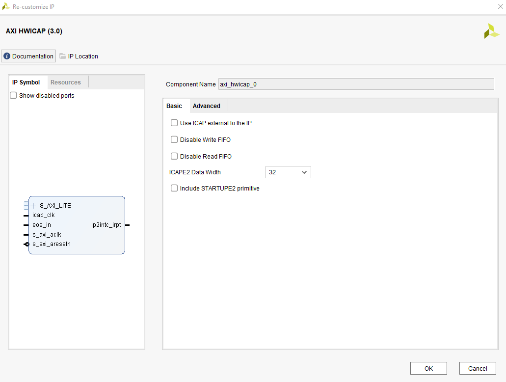
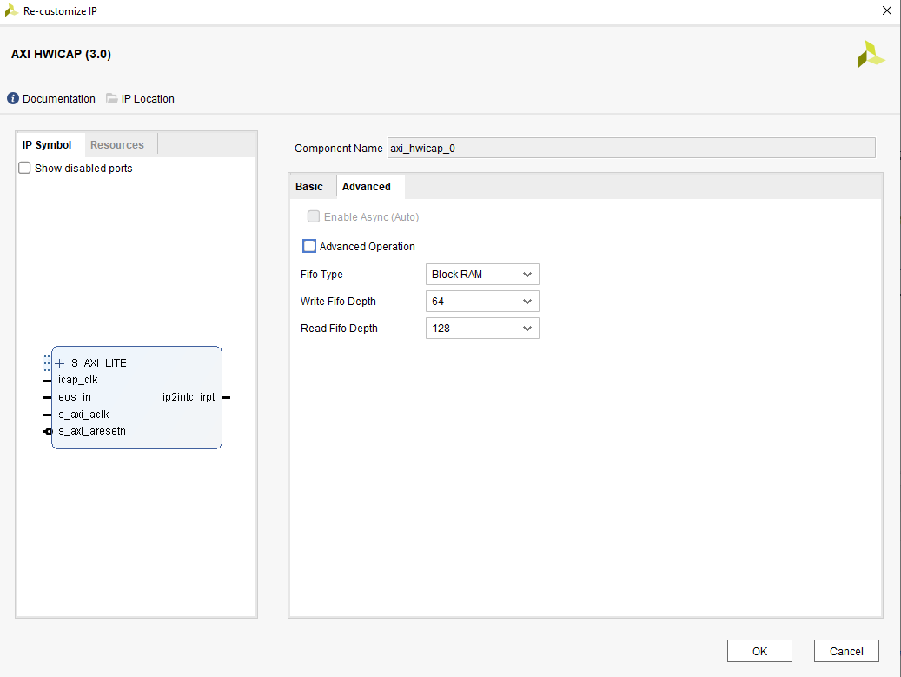
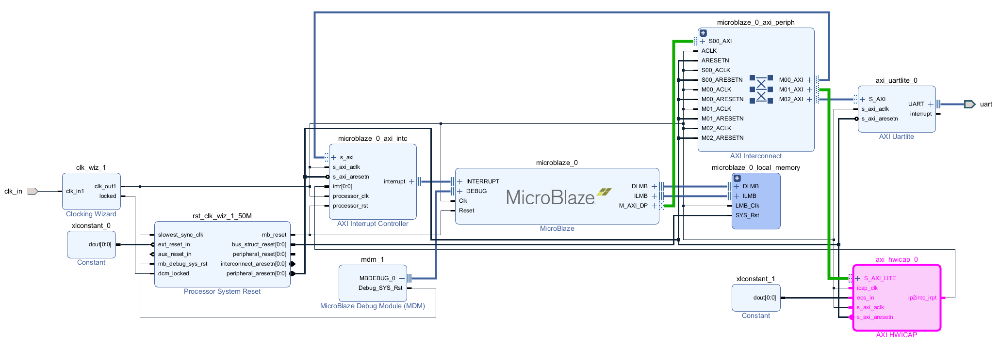
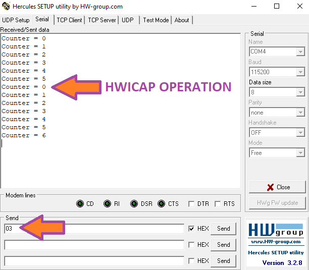

# Xilinx HWICAP IP

Xilinx's HWICAP IP is a powerful IP that allows FPGA to be reconfigured during operation, using ICAP interface. ICAP (Internal Configuration Access Port) is an interface that provides access to the internal configuration memory of Xilinx FPGAs. Thanks to this interface, FPGAs can be partially or fully reprogrammed during runtime. The list of commands that can be sent through the ICAP interface on Xilinx 7-Series FPGAs can be found in the UG470 7-Series FPGAs Configuration User Guide. Additionally, the usage details and register map for AXI HWICAP IP are provided in the PG156 AXI HWICAP Product Guide. These documents together enable direct interaction with the FPGA configuration logic via the AXI4-Lite to ICAP bridge.

With HWICAP IP, it is possible to perform a hardware-based run-time reset without cutting power to FPGA. This feature enables fast and seamless recovery and reset in applications that require reliability, without powering down system. In this article, we explain how to reset FPGA at any desired moment using HWICAP IP, and how to configure it accordingly.

- Vivado 2022.1 and Vitis 2022.1 are used throughout the article.
- The Basys3 demo board is used.
- Communication with HWICAP IP is achieved via MicroBlaze IP.

The usage of the IP is explained through a demo project. Certain steps need to be followed for this.

## Creating Vivado Project

Vivado project is created and bitstream generated by following the instructions in [README.md](./fpga/README.md) file. Afterward, from the directory containing `.bit` file, the `.mmi`, `.bit`, and `.xsa` files mentioned in the article must be copied into `sw` folder as `design_1_wrapper.mmi`, `design_1_wrapper.bit`, and `design_1_wrapper.xsa`. For using IP in a different project, please refer to the section below.

### IP Settings

Below is a list of required and applied IP configurations:

- `S_AXI_LITE` must be connected to an AXI Interconnect IP. This can be done automatically.
- `icap_clk` must be below 100 MHz. In the sample project, a 50 MHz clock is connected.
- `s_axi_aclk` is also set to 50 MHz to be synchronous with `icap_clk`. This way, the IP does not use `icap_clk` port.
- `s_axi_aresetn` is driven with a reset that is synchronous with `s_axi_aclk`.
- `eos_in` is tied to a constant value of `1`. The `eos_in` (end of startup) pin is an input that indicates the completion of FPGA startup sequence. Driving this pin high ensures that HWICAP IP is always ready to communicate with ICAP interface. It is typically required to keep this pin active for the IP to work properly.
- The `ip2intc_irpt` port is connected to AXI interrupt controller but is not used.

Below are the IP settings used in the demo project:





The block design of the demo project is also shown below:



## Creating Vitis Project

The Vitis project is created and `.elf` file generated by following the instructions in [README.md](./sw/README.md) file.

In Vitis project, a counter value is sent over UART once per second and incremented. When the value `0x03` is sent to FPGA over UART, the necessary writes are performed to HWICAP IP to trigger a reset. The values written are given below. After these values are sent, FPGA performs a hard reset, and UART counter output should restart from zero. Below, a sample code is shared. The complete one can be found on my Github page.

```c
// Intilization
ConfigPtr = XHwIcap_LookupConfig(HWICAP_DEVICE_ID);
Status = XHwIcap_CfgInitialize(&HwIcap, ConfigPtr, ConfigPtr->BaseAddress);

// Defining array which should be sent to ICAP
u32 WriteData[5];
WriteData[0] = 0xFFFFFFFF; // Dummy word or preamble
WriteData[1] = 0xAA995566; // Sync Word
WriteData[2] = 0x20000000; // NOOP
WriteData[3] = 0x30008001; // Write command to CMD register (1 word)
WriteData[4] = 0x0000000F; // IPROG command

// Send commands to ICAP
Status = XHwIcap_DeviceWrite(&HwIcap, WriteData, 5);
```

- `WriteData[0] = 0xFFFFFFFF`: This is called a dummy word or preamble.
- `WriteData[1] = 0xAA995566`: Informs FPGA's ICAP module that the following data is in bitstream format.
- `WriteData[2] = 0x20000000`: This is a NOOP (No Operation) command. It instructs ICAP to do nothing. It is typically used to insert gaps between commands or for safe transitions.
- `WriteData[3] = 0x30008001`: Indicates that 1 word of data will be sent.
  - `0x3`: Type 1 packet
  - `0x00000`: Reserved
  - `0x00100`: Register address: CMD register (address 0x04)
  - `0x1`: One word
- `WriteData[4] = 0x0000000F`: This is IPROG command. Writing this value to CMD register instructs FPGA to reboot via ICAP.

## Generating MCS File

At this point, we have all necessary files to generate `.mcs` file that will be loaded into the board. Open a terminal or command prompt and source Vivado using `settings64.bat` file which can be found Vivado setup directory. The following command is used on Windows 10:

```bash
D:\Xilinx\Vitis\2022.1\settings64.bat
```

The following command merges `.elf` and `.bit` files and creates a new `.bit` file that includes vivado and vitis projects:

```bash
updatemem -meminfo ./design_1_wrapper.mmi -data ./hwicap_ws/app_ublaze/Debug/app_ublaze.elf -bit ./design_1_wrapper.bit -proc design_1_i/microblaze_0 -out top_with_SW.bit -force
```

Then, using `top_with_SW.bit`, `.mcs` file is generated:

```bash
write_cfgmem -format mcs -size 16 -interface spix4 -loadbit "up 0x0 ./top_with_SW.bit" -file output.mcs -force
```

As a result of these operations, the generated `.mcs` file is flashed to Basys3 board, and the power is on. Then, for testing purposes, the value `0x03` should be sent via any serial interface.



As seen above, the counter is printed to the screen every second, starting from zero. When the value 0x03 is sent via UART, FPGA performs a hard reset and restarts from the beginning.
