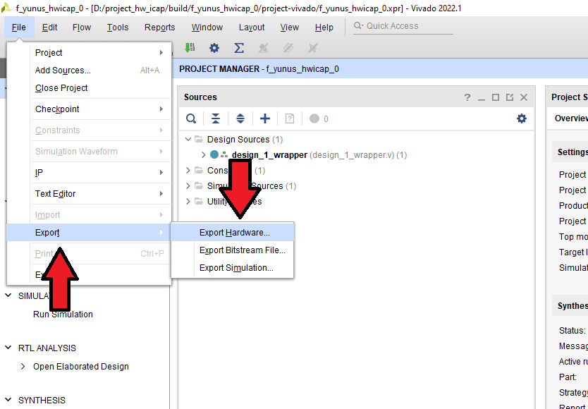

# Creating Vivado Project

To create the project from scratch, I used `fusesoc` library. In order to generate FPGA project using fusesoc, the following tools and libraries are required:

- Vivado 2022.1  
- pip  
- make  
- fusesoc  

## Project Creation Steps

First, open a terminal (Linux) or command prompt (Windows) inside `fpga` directory of the downloaded repository. Then, Vivado must be sourced (example below is for Windows). To source Vivado, you must locate `settings64.bat` file inside the installation directory.

```bash
D:\Xilinx\Vivado\2022.1\settings64.bat
```

Next, run the following two commands to generate the makefiles used for project creation:

```bash
fusesoc library add hwicap .
fusesoc run --target=project --setup hwicap
```

Navigate to the generated build directory using `cd` command and move into the directory where `Makefile` is located. That means entering `build\f_yunus_hwicap_0\project-vivado`. Then, launch Vivado GUI with the following command:

```bash
make build-gui
```

At this point, FPGA project can be synthesized. If a Vitis project will be created afterward, `.xsa` file must be exported. To do this, click on the option shown in the figure below:



In `Output` settings, make sure to check `Include Bitstream` option, and set the export directory to `sw` folder. Also, the file should be named `design_1_wrapper.xsa`.

## Notes

When working on Windows, the length of the directory path where the project is created matters. If the character limit is exceeded, the project might open but fail to synthesize properly. In such cases, the generated project can be copied to a shorter path. Alternatively, `build` directory and its subdirectory names can be shortened.
