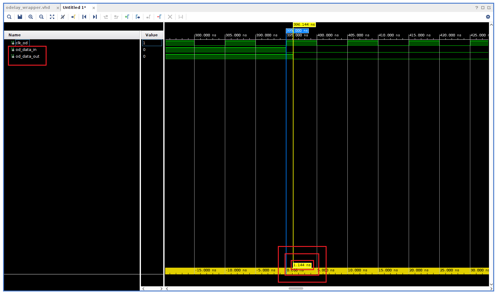
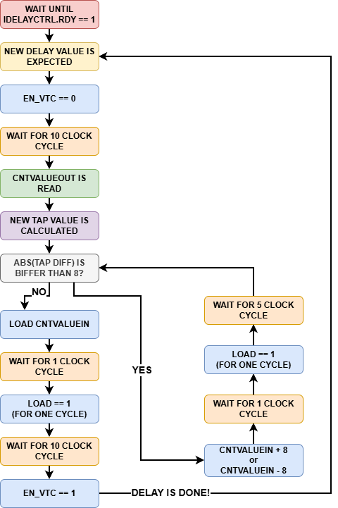

= UltraScale+ FPGA'lerde ODELAYE3 Primitive Kullanımı
Yunus Esergün <yunusesergun2316@gmail.com>
:stem: latexmath
:toc:
:toclevels: 4
:imagesdir: assets
:sectnums:

<<<

FPGA tasarımlarında çoğunlukla clock frekansı, setup/hold süreleri veya clock
domain crossing gibi clock cycle seviyesinde zamanlama problemleri ile
uğraşılır. Fakat özellikle yüksek hızlı ADC/DAC, source-synchronous interface
veya FPGA dışına çıkan clock/data sinyallerinde birkaç yüz *pikosaniyelik*
farkın bile önemli olduğu durumlar bulunabilmektedir.

Örneğin FPGA'dan bir entegreye gönderilen clock ve data sinyallerinin PCB
üzerindeki yolları tamamen eşit olmayabilir. Bunun yanında karşı taraftaki
entegre, datayı clock'un belirli bir noktasında görmek isteyebilir. Böyle bir
durumda clock'u bir clock cycle geciktirmek çoğu zaman anlamsızdır. İhtiyaç
duyulan şey bazen sadece:

[source,text]
----
200 ps
400 ps
650 ps
----

gibi oldukça küçük miktarlarda delay ekleyebilmektir.

AMD/Xilinx UltraScale ve UltraScale+ FPGA'lerde bu tarz işlemler için
kullanılabilecek kaynaklardan biri `ODELAYE3` primitive'idir.

`ODELAYE3`, FPGA içerisinden dışarıya gönderilecek bir sinyale pikosaniye
mertebelerinde programlanabilir bir delay eklenmesini sağlar. UltraScale
mimarisinde primitive, *512 tap'lik* programlanabilir bir delay line içerir ve
çıkış yolunda kullanılmak üzere tasarlanmıştır. ODELAYE3, programmable logic
veya OSERDES gibi çıkış kaynakları ile IOB arasına yerleştirilebilir.

AMD'nin UltraScale ve UltraScale+ SelectIO kaynaklarını ayrıntılı olarak
anlattığı *UG571 – UltraScale Architecture SelectIO Resources User Guide*
dokümanına https://docs.amd.com/v/u/en-US/ug571-ultrascale-selectio[bu bağlantıdan]
ulaşılabilir. Bu yazı kapsamında bu dokümandan çokça yararlanılmıştır.

ODELAYE3 primitive'inin portlarını ve kullanım detaylarını görmek için ayrıca
https://docs.amd.com/r/2024.1-English/ug974-vivado-ultrascale-libraries/ODELAYE3[primitive dokümantasyonu]
incelenebilir.

ODELAY genel amaçlı bir FPGA içi combinational delay elemanı değildir. I/O
tarafında bulunan `dedicated` bir delay kaynağıdır. Bu yüzden herhangi bir RTL
sinyalini FPGA içerisinde rastgele geciktirmek amacıyla kullanılmamalıdır.

<<<

== ODELAYE3 Nerelerde Kullanılabilir?

ODELAYE3 kullanım ihtiyacını sadece *sinyali geciktirmek* şeklinde düşünmek
biraz yüzeysel olacaktır. Asıl amaç çoğu zaman iki sinyal arasındaki *timing
relationship* üzerinde ince ayar yapabilmektir.

Örneğin FPGA'dan bir ADC veya DAC'e hem data hem de clock gönderildiği
düşünülebilir. PCB propagation delay, FPGA output delay ve karşı taraftaki
cihazın setup/hold gereksinimleri sonucunda data'nın clock edge'ine göre
istenilen yerde olmadığı görülebilir.

Teorik olarak durum aşağıdaki gibi olabilir:

[source,text]
----
DATA  ───────XXXXXXXXXXXXXXXX────────
                    ^
                    |
CLOCK ──────────────↑────────────────
----

Data transition noktası sampling edge'e fazla yakınsa setup veya hold margin
azalacaktır.

Clock veya data yoluna küçük miktarda delay eklenerek sampling point'in data eye
içerisinde daha uygun bir bölgeye taşınması mümkün olabilir.

Başka bir kullanım alanı PCB üzerindeki hatlar arasındaki propagation delay
farklarının giderilmesidir. Yüksek hızlı paralel arayüzlerde birkaç yüz ps'lik
farklar dahi önemli olabilir.

<<<

== ODELAYE3 Delay Line Yapısı

ODELAYE3 içerisinde *512 tap* bulunmaktadır. `CNTVALUEIN` ve `CNTVALUEOUT`
portlarının 9 bit olmasının temel sebebi de budur.

Bir tap, delay line içerisindeki bir delay adımını ifade eder. Her bir tap'ın
karşılık geldiği ps değeri mevcuttur ve birçok etmene bağlı olarak bu değer
değişebilmektedir.

Fakat burada oldukça önemli bir ayrıntı bulunmaktadır. Bir tap'ın kaç pikosaniye
olduğu her durumda sabit kabul edilmemelidir.

Process, voltage ve temperature (PVT) değişimleri delay line'ın fiziksel
davranışını etkileyebilir. Bundan dolayı UltraScale mimarisinde ODELAYE3 için
iki farklı delay yaklaşımı bulunmaktadır: `COUNT` ve `TIME`.

https://docs.amd.com/v/u/en-US/ug571-ultrascale-selectio[AMD dokümantasyonunda]
COUNT modunda delay line'ın kalibre edilmediği, TIME modunda ise IDELAYCTRL
tarafından kalibrasyon ve voltage/temperature compensation uygulandığı açıkça
belirtilmektedir. `TIME` modunda `IDELAYCTRL` primitive'inin kullanılması
kalibrasyon açısından şarttır.

Bu durumda, `COUNT` modunda bir süre sonra, PVT etmenine bağlı olarak delay
değeri zamanla değişebilir fakat `TIME` modunda durum böyle değildir.

<<<

== DELAY_FORMAT: COUNT ve TIME

ODELAYE3 içerisindeki önemli attributelar'dan biri `DELAY_FORMAT`'tır.

İki farklı seçenek bulunmaktadır:

|===
| `DELAY_FORMAT` | Kullanıcı Açısından Anlamı | PVT Compensation
| `COUNT` | Delay tap sayısı olarak düşünülür | Yok
| `TIME` | Delay fiziksel zaman, yani ps olarak düşünülür | Var
|===

=== COUNT Mod

COUNT mod kullanıldığında delay line doğrudan tap sayısı üzerinden kontrol
edilir.

Örneğin, *CNTVALUE = 100* denildiğinde 100 tap seçilir. Burada *100 tap = 250
ps* veya *100 tap = 270 ps* gibi fiziksel bir süre garanti edilmez.

AMD de COUNT mod için gerçek tap delay'inin önemli olmadığını, tasarımın
yalnızca tap sayısı üzerinden çalışması gerektiğini belirtmektedir. Ayrıca COUNT
mod içerisinde IDELAYCTRL kullanılmasına gerek yoktur ve `EN_VTC` Low
tutulmalıdır.

Bu mod özellikle fiziksel delay'in kaç ps olduğundan çok, bir data eye
içerisinde kaç tap hareket edildiğinin önemli olduğu durumlarda kullanılabilir.

=== TIME Mod

TIME mod içerisinde amaç farklıdır. Burada delay örneğin 500 ps gibi fiziksel
zaman cinsinden düşünülür.

UltraScale+ cihazlarda tek ODELAYE3 için TIME mod `DELAY_VALUE` aralığı cihaz
ailesine göre sınırlıdır. UG571 dokümanında UltraScale cihazlar için 1250 ps,
UltraScale+ cihazlar için ise *1100 ps* üst sınırı belirtilmektedir.

TIME mod içerisinde `IDELAYCTRL` kullanılması gerekir. Bunun temel sebebi delay
line'ın voltage ve temperature değişimlerine karşı kalibre edilmesidir.

<<<

== IDELAYCTRL Neden Gereklidir?

TIME mod kullanımının en önemli elemanlarından biri `IDELAYCTRL` primitive'idir.

IDELAYCTRL içerisindeki temel portlar:

|===
| Port | Yön | Açıklama
| `REFCLK` | Input | Delay calibration için kullanılan reference clock. 300 MHz–800 MHz aralığında bir clock verilmelidir.
| `RST` | Input | IDELAYCTRL active-high reset.
| `RDY` | Output | Calibration işleminin tamamlandığını belirtir.
|===

IDELAYCTRL, kendisine verilen reference clock'u kullanarak aynı bölgede bulunan
TIME-mod IDELAYE3 ve ODELAYE3 delay line'larını PVT değişimlerine karşı kalibre
eder.

Bu yazıda daha sonra anlatılacak ODELAY primitive'i içerisinde reference clock
`333.333333 MHz` olarak kullanılmaktadır.

Aşağıda IDELAYCTRL primitive'ine ait port map örneği yer almaktadır:

[source,vhdl]
----
-- IDELAYCTRL: IDELAYE3/ODELAYE3 Tap Delay Value Control
IDELAYCTRL_inst : IDELAYCTRL
generic map (
    SIM_DEVICE => "ULTRASCALE"
)
port map (
    RDY    => ctrl_rdy,
    REFCLK => ctrl_refclk,
    RST    => ctrl_rst
);
----

<<<

== ODELAYE3 Primitive Portları

ODELAYE3 primitive'inin temel portları aşağıdaki gibidir:

|===
| Port | Yön | Bit | Açıklama
| `ODATAIN` | Input | 1 | Geciktirilecek sinyaldir.
| `DATAOUT` | Output | 1 | ODELAY uygulanmış sinyaldir.
| `CLK` | Input | 1 | ODELAY dinamik kontrol işlemlerinin clock'udur. Geciktirilen sinyalin clock'u olmak zorunda değildir.
| `CNTVALUEIN` | Input | 9 | `VAR_LOAD` kullanımında yüklenecek yeni tap değeridir.
| `CNTVALUEOUT` | Output | 9 | Delay line'ın mevcut tap değerini gösterir. PVT değişimlerinde bu değer zamanla değişebilmektedir.
| `LOAD` | Input | 1 | `VAR_LOAD` kullanımında `CNTVALUEIN` değerinin delay line'a yüklenmesini sağlar.
| `CE` | Input | 1 | `VARIABLE` veya `VAR_LOAD` mod içerisinde tap sayısının increment/decrement işlemini etkinleştirir.
| `INC` | Input | 1 | CE ile beraber kullanılarak tap değerinin artırılmasını veya azaltılmasını belirler.
| `EN_VTC` | Input | 1 | Voltage/temperature compensation mekanizmasını kontrol eder.
| `RST` | Input | 1 | Delay line'ı `DELAY_VALUE` attribute değerine resetler.
| `CASC_IN` | Input | 1 | Cascade delay yapısı için kullanılır.
| `CASC_OUT` | Output | 1 | Cascade yapısındaki bir sonraki delay elementine bağlantıdır.
| `CASC_RETURN` | Input | 1 | Cascade yapısının dönüş bağlantısıdır.
|===

Özellikle `CLK` portu yanlış anlaşılmaya müsaittir. CLK portu geciktirilen
sinyalin doğrudan clock'u değildir. `CLK`; `LOAD`, `CE` ve `INC` gibi kontrol
sinyallerinin clock'udur.

Aşağıda port map örneği yer almaktadır:

[source,vhdl]
----
-- ODELAYE3: Output Fixed or Variable Delay Element
ODELAYE3_inst : ODELAYE3
    generic map (
        CASCADE          => "NONE",
        DELAY_FORMAT     => "TIME",
        DELAY_TYPE       => "VAR_LOAD",
        DELAY_VALUE      => 1000,
        IS_CLK_INVERTED  => '0',
        IS_RST_INVERTED  => '0',
        REFCLK_FREQUENCY =>  333.3333333,
        SIM_DEVICE       => "ULTRASCALE_PLUS",
        UPDATE_MODE      => "ASYNC"
     )
    port map (
        CASC_OUT    => open,
        CNTVALUEOUT => od_cntvalue_out,
        DATAOUT     => od_data_out,
        CASC_IN     => '0',
        CASC_RETURN => '0',
        CE          => '0',
        CLK         => od_clk,
        CNTVALUEIN  => od_cntvalue_in,
        EN_VTC      => od_en_vtc,
        INC         => '0',
        LOAD        => od_load,
        ODATAIN     => od_data_in,
        RST         => od_rst
    );
----

Örnek kullanımı sonucundaki testbench görüntüsüne aşağıda yer verilmiştir.
ODELAY primitive'inin default olarak 144 ps bir delay değeri bulunmaktadır. Bu
değer gerçek zamanlı olarak yapılan testler farklı olabilir, muhtemel olarak
primitive propagation delay'i olduğu düşünülmektedir. Bunun yanı sıra,
`DELAY_VALUE` olarak eklenen 1000 ps değeri de sinyaller arasındaki zaman
farkında görülebilmektedir.

<<<

== DELAY_TYPE: FIXED, VARIABLE ve VAR_LOAD

ODELAYE3 içerisinde ikinci önemli seçim `DELAY_TYPE` attribute'ıdır.

Üç farklı seçenek bulunmaktadır:

|===
| DELAY_TYPE | Kontrol Yöntemi | Avantaj | Dezavantaj
| `FIXED` | Sabit `DELAY_VALUE` | Basit ve az kontrol mantığı gerektirir. | Runtime delay line değiştirilemez.
| `VARIABLE` | `CE + INC` | Tap tap ilerlemek kolaydır. | Büyük tap değişikliklerinde çok sayıda işlem ve latency gerekir.
| `VAR_LOAD` | `CNTVALUEIN + LOAD` | Hedef tap doğrudan yüklenebilir. | Update sequence dikkatli yönetilmelidir. Belli başlı kurallar bulunmaktadır.
|===

=== FIXED Mod

FIXED mod içerisinde delay, tasarım sırasında belirlenir. Örneğin:

[source,vhdl]
----
DELAY_TYPE  => "FIXED",
DELAY_VALUE => 500
----

Runtime içerisinde sürekli farklı delay değerleri denenmeyecekse oldukça basit
bir çözümdür.

=== VARIABLE Mod

VARIABLE mod içerisinde delay line `CE` ve `INC` sinyalleri yardımıyla tap tap
hareket ettirilebilir.

Bunun avantajı oldukça sade olmasıdır. Buna karşılık 100 tap'ten 300 tap'e
gitmek istendiğinde çok sayıda update işlemi gerekir.

=== VAR_LOAD Mod

Bu modda yeni tap değeri temel olarak `CNTVALUEIN` bus'ına verilir ve `LOAD`
kullanılarak delay line güncellenir.

AMD dokümantasyonu `VAR_LOAD` kullanımının hem `TIME` hem `COUNT` formatında
kullanılabildiğini belirtmektedir.

<<<

== UPDATE_MODE

ODELAYE3 ayrıca `UPDATE_MODE` attribute'ına sahiptir. `ASYNC`, `SYNC` ve
`MANUAL` seçenekleri bulunmaktadır.

Bu doküman kapsamında tanıtılan IP'de `ASYNC` tercih edilmiştir.

`ASYNC` modda delay update işlemleri data input transition'larından bağımsız
şekilde ODELAY control clock'u üzerinden yürütülür. `SYNC` modda update'in input
data transition'ı ile ilişkilendirilmesi sebebiyle uygulamaya göre beklenmeyen
glitch davranışları oluşabileceği unutulmamalıdır.

== EN_VTC ve Dynamic Delay Update

TIME mod kullanımında en kritik sinyallerden biri `EN_VTC` sinyalidir.

Normal çalışma sırasında EN_VTC `High` tutularak voltage/temperature
compensation aktif bırakılabilir.

Fakat ODELAY delay değeri değiştirileceği zaman compensation geçici olarak devre
dışı bırakılmalıdır.

AMD'nin VAR_LOAD/TIME prosedüründe paylaştığı adımlar temel alınarak aşağıdaki
akış oluşturulmuştur:

AMD ayrıca büyük `CNTVALUE` değişimlerinin *8 tap veya daha küçük adımlara
bölünmesini* güçlü bir şekilde önerir; 8 tap'ten büyük ani değişikliklerin
glitch oluşturabileceğini ve output tarafında serialization'ı bozabileceğini
belirtmektedir. Yani AMD maksimum 8 tap şeklinde adım adım hedef tap değerine
ulaşmayı çok ciddi bir şekilde önermektedir.

<<<

== Neden CNTVALUE Doğrudan Hesaplanmıyor?

TIME modunun ilginç taraflarından biri burada ortaya çıkmaktadır. Kullanıcı
*500 ps istiyorum* dediğinde ODELAYE3'ün runtime interface'ine doğrudan 500
yazılamamaktadır. Çünkü `CNTVALUEIN` TIME mod içerisinde dahi *tap
cinsindendir*. `DELAY_VALUE` attribute'ı ps cinsinden olmasına rağmen runtime
`CNTVALUEIN/CNTVALUEOUT` interface'i tap sayısı ile çalışır.

Dolayısıyla controller'ın ps ile tap arasında ilişki kurması gerekir.

Örneğin bilinen durumda:

[source,text]
----
Current Delay = 1000 ps
Current CNTVALUEOUT = 400
----

olsun.

Yeni istek:

[source,text]
----
New Delay = 750 ps
----

ise yaklaşık olarak:

[source,text]
----
New CNTVALUE = 400 × 750 / 1000 = 300
----

olarak hesaplanabilir.

Genel ifade:

[source,text]
----
                         Requested_Delay
New_CNT = Current_CNT × -----------------
                          Current_Delay
----

şeklindedir. Bu hesabı her değişiklikte yapmakta fayda bulunmaktadır çünkü her
bir tap'ın karşılık geldiği delay değeri PVT'ye göre değişebilmektedir.
