# Wavedrom

`Wavedrom` diye bir uygulama var. Bu uygulama sayesinde waveform, basit mantık devresi ve bitfield çizebiliyoruz. Çizimi yapması için `JSON` dilinde kendine has bir sentaksı kullanıyoruz. Bu tarz bir uygulamayı kullanmak doküman yazma konusunda çok yardımcı oluyor. JSON dilini bilmenize gerek yok (ben de bilmiyorum çok). Bu tutorial işinizi görecektir.

Özellikle RTL tasarımcılarının doküman yazarken kullandıkları protokolleri çizmesi adına kullanması çok kolay bir program. Çok basit bir sentaksı var, öğrenmesi gayet kolay. Bu yazıda bu uygulamayı kullanarak nasıl waveform çizme işlemini yapabileceğimizi aktaracağım. Mantık devresi ve bitfield çizmeyi hiç kullanmadığım için o kısımlara ayrıntılı değinmeyeceğim.

## Nasıl İndirilir

Online olarak [bu linkten](https://wavedrom.com/editor.html) kullanabiliyoruz fakat yine de bilgisayarımıza nasıl indirebileceğimizden de bahsedeyim.

İndirmesi ve açması çok kolay. Ben Windows10 üzerinde kullandım. O yüzden sadece Windows10'da nasıl indirilir onu aktaracağım. Temelde bir github repository'si olduğu için Release kısmından gerekli .zip dosyası indirilmeli. Aşağıda Relase sayfasının linkini paylaştım:

[Wavedrom İndirme Linki](https://github.com/wavedrom/wavedrom.github.io/releases)

Ben 3.4.0 versiyonunu kullandım (şu an en güncel versiyon bu). O yüzden `wavedrom-editor-v3.4.0-win-x64.zip` isimli dosyayı indirdim.

Kullanım olarak da .zip dosyasını açıp bilgisayarda herhangi bir yere kopyalayabilirsiniz. Sonrasında `wavedrom-editor.exe` çalıştırılarak program açılabilir.

## Örnek Gösterim

Örnek olması adına aşağıya `AXI4-Stream` protokolünü gösteren örnek bir wavedrom çizimi mevcut:

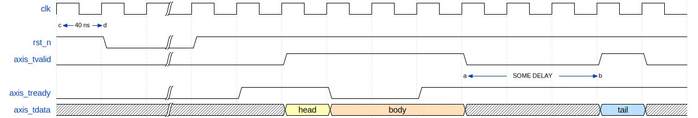

Yukarıda örnek olarak paylaştığım wavedrom görselinin kaynak kodu aşağıda verilmiştir:

```text
{
  signal: [
    // clk signal properties
    {
        name: 'clk',
        wave: 'p.|...........'
    },
    {
        node: 'cd............'
    },
    // rst_n signal properties
    {
        name: 'rst_n',
        wave: '10|1..........'
    },
    // axis_tvalid signal properties
    {
        name: 'axis_tvalid',
        wave: '0.|..1...0..10'
    },
    {
        node: '.........a..b.'
    },
    // axis_tready signal properties
    {
        name: 'axis_tready',
        wave: '0.|.1.0.1.....'
    },
    // axis_tdata signal properties
    {
        name: 'axis_tdata',
        wave: 'x.|..34..x..5x',
        data: ['head', 'body', 'tail']
    }
  ],
  config: { hscale: 2 },
  edge: [
    'a<->b SOME DELAY',
    'c<->d 40 ns'
  ]
}
```

Yukarıdaki kodu parçalara ayırarak nasıl yazıldığına bakalım:

## Sinyal Tanımlama

Sinyalleri tanımlamak ve çizim ile ilgili olarak çeşitli özellikler eklemek için `signal[]` key'i kullanılır. Sonrasında waveform üzerinde oluşturacağımız her bir satır için `{}` yani parantez kullanırız ve son satıra kadar her parantez sonrası virgül koymamız gerekir. Bu durumlar aslında `.json` sentaksıyla ilgili bir durumdur. Wavedrom'a özgü bir kural değildir.

Parantez içerisinde tanımlayacabileceğimiz itemler kısıtlıdır ama yeterlidir. `name`, `wave`, `node`, `data`, `period` ve `phase` tanımlanabilir. Ben, bunların dışında wavedrom uygulamasının anladığı bir item ismi göremedim. Bu altı item zaten yeterli oluyor.

## "name" Kullanımı

`name` ile sinyal ismi tanımlanır. `name:` ifadesi sonrası kesme işareti içerisine tanımlamak istediğimiz sinyal ismini yazarız. Aşağıda örnek bir .json kodu bulunuyor:

```text
{
  signal: [
    // Signal properties
    {
        name: 'example_signal'
    }
  ]
}
```

Bu kod sonrası wavedrom uygulaması içerisinde aşağıdaki gibi bir görüntüyü görebiliriz:

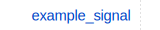

## "wave" ve "data" Kullanımı

Bir yukarıdaki görselde bariz şekilde göründüğü üzere sinyal tanımlaması var ama waveform yok. Waveform tanımlaması yapmak için aynı parantez içerisine `wave` item'i tanımlamamız gerekir. Aşağıda örnek bir kod bulunuyor:

```text
{
  signal: [
    // Signal properties
    {
        name: 'example_signal',
        wave: '..............'
    }
  ]
}
```

Bu kod sonrası wavedrom uygulaması içerisinde aşağıdaki gibi bir görüntüyü görebiliriz:


Görüldüğü üzere sinyale hiçbir değer tanımlaması yapılmadığı için `Don't Care` şeklinde gözüküyor. Kesme işareti içerisinde yer alan nokta işareti en son tanımlanan sinyali devam ettirmek için kullanılır, bu sayede her cycle içinde sinyali tekrar tekrar tanımlamaya gerek kalmaz.

- Not: Sinyal tanımlanmış olsa bile farklı cycle içerisinde `Don't Care` gözüksün isteniyorsa `x` işareti kullanılabilir.

"wave" ile tanımlanabilecek sinyal çeşitlerini aşağıda madde madde listeledim:

- `0` ve `1` tanımlamaları yaparak gerçek hayatta görebileceğimiz sinyaller elde edebiliriz. Gerçek hayattan kasıt şudur ki sinyallerin setup ve hold zamanları daha net gözükür fakat setup ve hold zamanlarını ayarlamak mümkün değildir. Aşağıda örnek bir kod ve waveformu bulunmaktadır:

```text
{
  signal: [
    // Signal properties
    {
        name: 'example_signal',
        wave: '01............'
    }
  ]
}
```

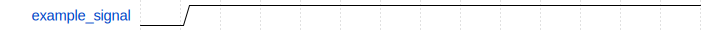

- `p` ve `n` tanımlamaları yaparak positive-negative edge ile başlayan periyodik sinyal üretilebilir. Aşağıda örnek bir kod ve waveformu bulunmaktadır:

```text
{
  signal: [
    // Signal properties
    {
        name: 'example_signal',
        wave: '.n............'
    }
  ]
}
```

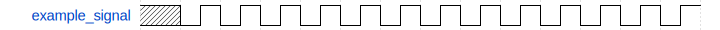

- `P` ve `N` tanımalamaları yaparak positive-negative edge ile başlayan clock sinyali üretilebilir. `P` ifadesiyle sinyalleri rising-edge ile örneklediğimizi, `N` ifadesiyle de sinyalleri falling-edge ile örneklediğimizi belirtmiş oluruz. Aşağıda örnek bir kod ve waveformu bulunmaktadır:

```text
{
  signal: [
    // Signal properties
    {
        name: 'example_signal',
        wave: '.n............'
    }
  ]
}
```

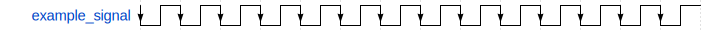

- 2'den 9'a kadar sayılar kullanılarak `data` tanımlaması yapılabilir. Ayrıca, `data:` isminde yeni bir key tanımlayarak köşeli parantez ile data içerisine istediğimiz yazıyı yazabiliriz. Aşağıda örnek bir kod ve waveformu bulunmaktadır:

```text
{
  signal: [
    // Signal properties
    {
        name: 'example_signal',
        wave: 'x2.3.4.5.6.7.8.9.',
        data: ['2', '3', '4', '5', '6', '7', '8', '9']
    }
  ]
}
```

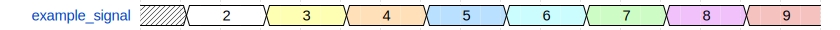

- `|` ifadesiyle uzun süre aynı kalan sinyalleri belirtebiliyoruz. Böylece waveformu daha optimize etmiş oluyoruz. Aşağıda örnek bir kod ve waveformu bulunmaktadır:

```text
{
  signal: [
    // Signal properties
    {
        name: 'example_signal',
        wave: 'x2.3.4.5.6.7.8.9.',
        data: ['2', '3', '4', '5', '6', '7', '8', '9']
    }
  ]
}
```

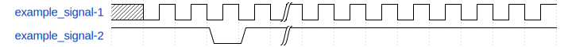

## "periyod" Kullanımı

`period` kullanılarak, ilgili sinyalin boyutu tanımlanan değere göre büyütülebilir. Bu sefer kesme işaretine gerek duyulmaz. Sıfır hariç tüm doğal sayılar kullanılabilir. Aşağıda örnek bir kod ve waveformu bulunmaktadır:

```text
{
  signal: [
    // Signal-1 properties
    {
        name: 'example_signal-1',
        wave: 'P................',
        period: 2
    },
    {},
    // Signal-2 properties
    {
        name: 'example_signal-2',
        wave: 'x2.3.4.5.6.7.8.9.',
        data: ['2', '3', '4', '5', '6', '7', '8', '9']
    }
  ]
}
```

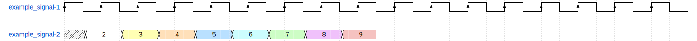

Yukarıdaki `example_signal-1` sinyalinin periyodu default haline kıyasla 2 katına çıkarılmıştır.

## "phase" Kullanımı

`phase` ile faz vermek mümkün. 1 periyot değeri kadar faz değişimi için (360 derece) 1 değeri vermek gerekir. Yani 1 periyot, 0 ve 1 değerleri arasına sığdırılmıştır. `periyod`' key'inde olduğu gibi burada da kesme işareti kulllanılmaz. Aşağıda örnek bir kod ve waveformu bulunmaktadır:

```text
{
  signal: [
    // Signal-1 properties
    {
        name: 'example_signal-1',
        wave: 'P................',
        period: 1,
        phase: 0.2
    },
    {},
    // Signal-2 properties
    {
        name: 'example_signal-2',
        wave: 'x2.3.4.5.6.7.8.9.',
        data: ['2', '3', '4', '5', '6', '7', '8', '9']
    }
  ]
}
```

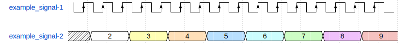

## "node" Kullanımı

`node` ile yeni bir satırda sinyaller özelinde ok işaretleriyle gösterimler yapmak mümkün. Aslında wavedrom uygulamasının kendi guide'ında ayrıntılı bir şekilde neler yapılabilir göstermiş ama ben kısa bir örnek göstereceğim. Daha kompleks kullanımlar için paylaştıkları guide'ı incelemenizi öneririm.

`node` kullanmak için `signal` haricinde bir de `edge` tanımlamamız gerekir. Bu alan içerisinde kesme işareti içerisinde ilk önce ok işaretlerinin ucunda gözükecek harf tanımlamasını yaparız. Sonrasında boşluk bırakarak oklar arasında gözükecek ifadeyi yazarız. Aşağıda örnek bir kod ve waveformu bulunmaktadır:

```text
{
  signal: [
    // Signal-1 properties
    {
        name: 'example_signal-1',
        wave: 'P................',
        period: 2,
        phase: 0
    },
    {
        node: 'c.d............'
    },
  ],
  edge: [
    'c<->d 40 ns'
  ]
}
```

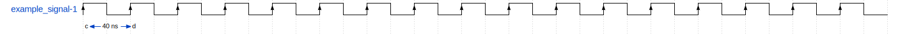

## Diğer Özellikler

Bunlara ek olarak; eğer iki sinyal arasında (2 satır) boşluk oluşmasını istiyorsak içi boş parantezler koymamız yeterli. Aşağıda örnek bir kod ve waveformu bulunmaktadır:

```text
{
  signal: [
    // Signal-1 properties
    {
        name: 'example_signal-1',
        wave: 'P................'
    },
    {},
    // Signal-2 properties
    {
        name: 'example_signal-2',
        wave: 'x2.3.4.5.6.7.8.9.',
        data: ['2', '3', '4', '5', '6', '7', '8', '9']
    }
  ]
}
```

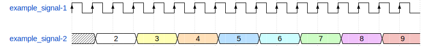

Son olarak tüm sinyalleri etkileyecek şekilde scaling ile oynayabiliyoruz. Bunun için `signal` ve `edge` gibi `config` diye bir alan açıyoruz ve burada `hscale` tanımlaması yapıyoruz. `signal` içerisinde olduğundan farklı olarak `config` tanımlaması yaparken köşeli parantez kullanmamıza gerek kalmaz. Aşağıda örnek bir kod ve waveformu bulunmaktadır:

```text
{
  signal: [
    // Signal-1 properties
    {
        name: 'example_signal-1',
        wave: 'P................',
        period: 1,
        phase: 0
    },
    {
        node: 'cd...............'
    },
    // Signal-2 properties
    {
        name: 'example_signal-2',
        wave: 'x2.3.4.5.6.7.8.9.',
        data: ['2', '3', '4', '5', '6', '7', '8', '9']
    }
  ],
  config: { hscale: 2 },
  edge: [
    'c<->d 40 ns'
  ]
}
```

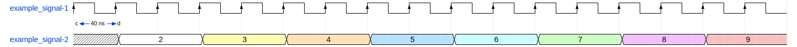

Aşağıda `hscale: 4` yapılmış kod ve waveform bulunuyor:

```text
{
  signal: [
    // Signal-1 properties
    {
        name: 'example_signal-1',
        wave: 'P......',
        period: 1,
        phase: 0
    },
    {
        node: 'cd..........'
    },
    // Signal-2 properties
    {
        name: 'example_signal-2',
        wave: 'x2.3.4.',
        data: ['2', '3', '4', '5', '6', '7', '8', '9']
    }
  ],
  config: { hscale: 4 },
  edge: [
    'c<->d 40 ns'
  ]
}
```

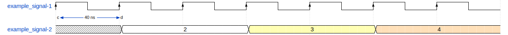

Bu kadar anlattım evet ama kendi yayınladıkları wavedrom guide da var. Daha ayrıntılı özelliklerden ve kullanımlardan bahsediyor. Onu açmak için de aşağıdaki görseldeki belirtilen yerde guide bulunabilir:

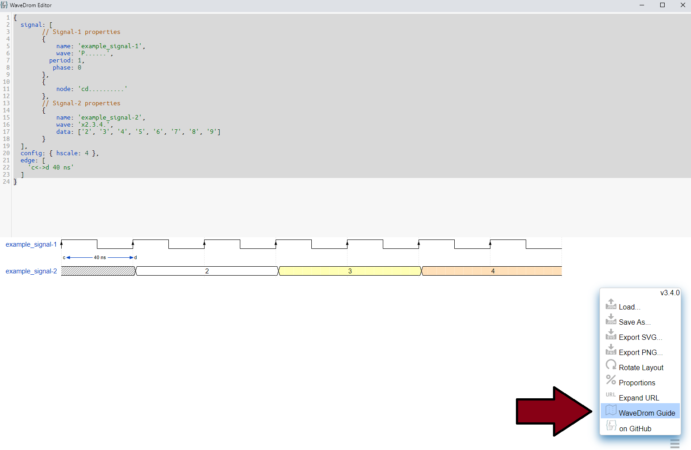

## Son Notlar

Program, dokümantasyon işlerinde ve modül seviyesinde mimari kurabilmek için çok iyi. Bunun yanında basit düzeyde `mantık devresi` çizimi de yapabiliyor. Fakat, ben bu özelliği henüz deneyimlemedim. Kullanılabileceği birçok yer olur diye düşünüyorum. Aşağıya kendi paylaştıkları örnek kodu ve mantık devre görüntüsünü ekledim:

```text
{ assign:[
  ["out",
    ["|",
      ["&", ["~", "a"], "b"],
      ["&", ["~", "b"], "a"]
    ]
  ]
]}
```


Bir de `bitfield` çizme özelliği var. Bu özelliği de henüz deneyimlemedim ama görüntü olarak çok iyi duruyor ve kullanımı gerçekten çok basit. Bitfield özelliği sayesinde paket içeriği tanımlamaları yapabiliyoruz. Aşağıya kendi paylaştıkları örnek kodu ve bitfield görüntüsünü ekledim:

```text
{
    reg: [
        {
            bits: 7,
            name: 'opcode',
            attr: 'OP-IMM'
        },
        {
            bits: 5,
            name: 'rd',
            attr: 'dest'
        },
        {
            bits: 3,
            name: 'func3',
            attr: ['ADDI', 'SLTI', 'SLTIU', 'ANDI', 'ORI', 'XORI'],
            type: 4
        },
        {
            bits: 5,
            name: 'rs1',
            attr: 'src'
        },
        {
            bits: 12,
            name: 'imm[11:0]',
            attr: 'I-immediate[11:0]',
            type: 3
        }
  ],
  config: {hspace: 2}
}
```

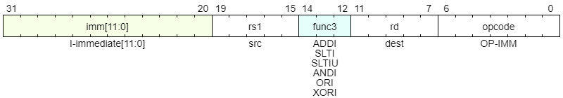

Bitfield kullanımı tutorial boyunca anlattıklarıma bayağı bir benziyor. `signal` yerine `reg` gelmiş gibi duruyor. Ayrıca `bits`, `attr` ve `type` özellikleri eklenmiş.

## Referanslar

- [Wavedrom Release Sayfası](https://github.com/wavedrom/wavedrom.github.io/releases)
- [Wavedrom Github Sayfası](https://github.com/wavedrom/wavedrom.github.io)
- [Online Wavedrom Sayfası](https://wavedrom.com/editor.html)
- [Wavedrom Tutorial](https://wavedrom.com/images/SNUG2016_WaveDrom.pdf)
- [Wavedrom Signal Tutorial Sayfası](https://wavedrom.com/tutorial.html)
- [Wavedrom Logic Circuit Tutorial Sayfası](https://wavedrom.com/tutorial2.html)
